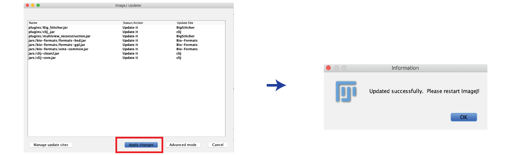

# Keep Fiji Up-To-Date
{: .d-inline-block }

Fiji
{: .label .label-green }

## Introduction
It is important to keep Fiji up-to-date: Plugins are constantly being improved and bugs are being fixed. Keeping up to date is easy with the *Update Manager*.

**Tip:** When you write a paper or are done with a project make a copy of your Fiji version and archive it with the project. Sometimes new plugin versions yield slightly different results. With an archived copy you can always reproduce the original results.

## Step-by-step

* After starting Fiji, the Updater may launch automatically. 
* To start the Updater manually, select: *Help > Update ...*

> **Important: Do not use *Help > Update ImageJ...*. This will update the core ImageJ manually and is usually not needed.**

* The Updater will now check whether updates are available.
* If updates are available they will be listed in a new window. Press *Apply Changes*.
* When prompted, restart Fiji.

## Trouble shooting
* **Directory is read-only error:** Fiji can only be updated (and install new plugins) if it has *write-permissions* in the folder where it lives. Make sure your Fiji is installed in one of these folders:
	* *MacOS*: 
		* *Applications* and *Desktop* folder work well.
		* *Documents* and *Downloads* folder can cause issues.
	* *Windows*:
		* Folders in *home* directory should work well.
		* *Program Files* can cause issues.
* **Connection to server cannot be made:** The updater makes connection to ImageJ servers to pull the updates. Sometimes the server is down and this results in a long error-message to the console. Is the [ImageJ wiki](https://imagej.net/Welcome) down as well? Best wait and try again later.

