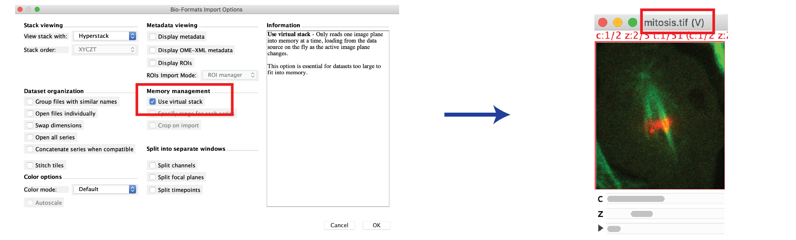
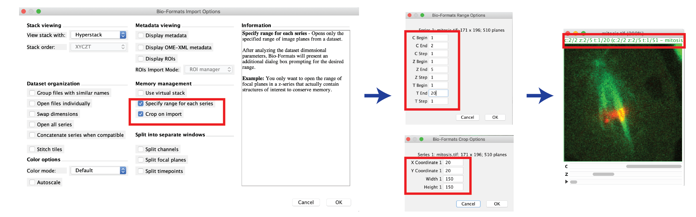
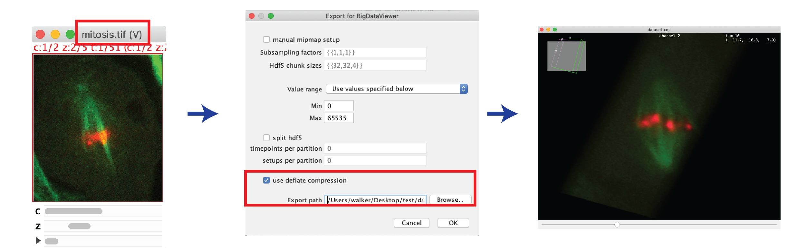

# Open Large Data
Fiji 
{: .label .label-green }

## Introduction
Datasets which are tens or hundreds of GB usually don't fit into the RAM memory of a computer anymore. Therefore they require special steps when opening in Fiji.

We show three options to load and visualize the data in Fiji here:
1. *Load data virtually*
2. *Load a subset of the data*
3. *Visualize with BigDataViewer*

**Tip 1:** Acquire also a small test data set when at the microscope (for example with 2 timepoints instead of 100). This test set will make it much less painful to develop an analysis workflow.

**Tip 2:** Use a workstation (like LIPS computers) which has larger RAM memory than your laptop. If you're lucky the data now fits into RAM and you can directly open the image normally.

## Step-by-step
### Option 1: Load data virtually
> *Prerequisite: **Bio-Formats** Update site is activated ([see general instructions](https://imagej.net/Following_an_update_site)).*

Only the current slice is loaded into memory. This is good for previewing the full dataset quickly, but processing options are limited.

* Select *File > Import > Bio-Formats*, then select your image (or the master file, if a series).
* Check the *"Use virtual stack"* box, then press OK.
* The image title has a *"(V)"* appended which means that the image is loaded virtually. 
* Examples of what can and cannot be done with virtual images:
	* Max-Projection: Possible. The projected image must fit into memory.
	* Filtering/Blurring: not possible.
	* Copy a Roi region or substack: Possible, but the copied region is loaded into memory.

### Option 2: Load a subset of the data
> *Prerequisite: **Bio-Formats** Update site is activated ([see general instructions](https://imagej.net/Following_an_update_site)).*

Data is cropped in space or time so that it fits into memory. This is very useful if a specimen is for example surrounded by lots of background. Or if the data can be processed sequentially, for example frame by frame.

* Select *File > Import > Bio-Formats*, then select your image (or the master file, if a series).
* Check the *"Specify range for each series"* and/or *"Crop on import"* box, then press OK.
* Choose the channels, slices, frames and Roi region that you want to import, then press OK.
* The image is loaded into memory, and the reduced ranges can be seen in the image status bar.

### Option 3: Visualize with BigDataViewer
> *Prerequisite: **Bio-Formats** Update site is activated ([see general instructions](https://imagej.net/Following_an_update_site)).*

The [BigDataViewer](https://imagej.net/BigDataViewer) ("BDV") is very useful for exploring even very large datasets interactively and from any angle. Try it also especially when the *virtual loading* was too unresponsive. For actual image processing like thresholding you will however have to go back to "standard" ImageJ image windows.

* For displaying in BDV, the dataset should be converted to HDF5 format (a hierarchical data format which allows for fast visualization) first:
* Open the image virtually with Bio-Formats, as described in [Option 1](#option-1:-load-data-virtually).
* Make sure the image window is selected, then select: *Plugins > BigDataViewer > Export Current Image as XML/HDF5*.
* Define a save name, press OK, then wait until export is done.
* Open the resaved image with BigDataViewer: *Plugins > BigDataViewer > Open XML/HDF5*.

#### **Quick usage instructions for BDV**
BDV window must be selected for steps below:
* For help on navigation, bookmarking etc: *Help > Show Help*.
* To change channel brightness and color: *Settings > Brightness & Color*.
* Show all channels in multi-channel image: *Settings > Visibility & Grouping*, then check *"enable fused mode"*.
* Use bookmarking (see *Help* menu) to store positions and to go back to them. Also store the initial position to be able to reset the view if you lost the object.
* Save the settings: *File > Save settings*.

For detailed instructions check the [BigDataViewer webpage](https://imagej.net/BigDataViewer). 

#### **Troubleshooting and more options**
* If the export to XML/HDF5 causes trouble (is very slow), try exporting with the [BigStitcher](https://imagej.net/BigStitcher) toolbox:
	* *Prerequisite: **BigStitcher** Update site is activated.*
	* Select *Plugins > BigStitcher > Batch Processing > Define Dataset ...*
	* Walk through the wizard, try to stick with defaults, resave as HDF5 ([detailed instructions here](https://imagej.net/BigStitcher_Define_new_dataset)).
* An exported XML/HDF5 dataset can also be opened via the BigStitcher plugin: *Plugins > BigStitcher > BigStitcher*.
	* The viewing window is exactly the *BigDataViewer*.
	* But there is an additional table for selecting timepoints, channels, etc..

## Alternatives
#### Imaris
* Imaris can handle large data automatically. When opening your data in Imaris for the first time it gets automatically converted (copied) to the proprietary *.ims* format. This is a hierarchical data format which allows for responsive viewing of large data.

