# Deconvolution using HuygensPro
{: .d-inline-block }

Huygens
{: .label .label-green }

## Introduction
Microscopes produce an image of a real-world object by convolving it with the the so called point spread function (PSF). Deconvolution is a mathematical operation used in image restoration to recover an image that is degraded by this convolution.

The PSF is the 3D blurry image of such a single point light source and is a measure of quality of an optical system. The PSF of a system is mostly determined by the objective used, the wavelength of the light and the refractive index of the immersion and sample media. 

[Huygens](https://svi.nl/Huygens-Professional) software is available at CBG which allows for deconvolution of various types of microscopy images. Additional capabilities include chromatic aberration correction and colocalization analysis. 

For more details on deconvolution check the [documentation from Huygens](https://svi.nl/Huygens-Deconvolution).

### Features of Huygens at CBG
* Currently licenses are available for deconvolution of images acquired through **confocal, spinning disk, widefield** systems. 
* Available in two flavors:
  * **HuygensPro**: GUI-based, useful for exploration of new data
  * **Huygens Remote Manager**: web-based, useful for batch processing 

This how-to guide is about a basic deconvolution pipeline using **HuygensPro**. 

## Step-by-step
We divide the steps into 2 sections - before deconvolution and how to run deconvolution using HuygensPro.

**Note**: Some of the steps are specific to MPI-CBG infrastructure and commented with the following notations.

***CBG network***: Requires to be connected to the internal CBG network. If working from a different network, connect via VPN.  
***Login required***: Requires login. Contact [IPF](mailto:ipf@mpi-cbg.de) for details.

## Section 1: Prior to Deconvolution
### Step 1: Data Acquisition
* Deconvolution is an important pre-requisite if you plan to do shape and size measurements, and colocalization.
* The data acquisition plays an important role if you need good deconvolution results.
* General rule of thumb: **give importance to sampling than signal**, i.e. noise is acceptable but not undersampling.
* If you plan to use measured PSF, make sure to acquire fluorescent bead images as well.

#### **General guidelines**
* **Sampling**
   * Make sure you sample your data well especially in Z. Use the [Sampling calculator](https://svi.nl/NyquistCalculator) to get the ideal Nyquist sampling rate.

	> *Confocal: up to 40% undersampling is acceptable as compared to the ideal sampling.*  
	> *Widefield: stick to the ideal sampling rate as much as possible.*

   * Z-stack range: image till the edge of the object + ½ PSF above and below sample. Especially important for Widefield. 
* **Saturation and clipping**
	* Accept noise. Noise is handled by Huygens very well.
	* Avoid saturating your image, the image does not have to look pretty!
	
	> *LSM acquisition: use accumulation or photon count instead of averaging.*
	
* **Metadata**
	* Save all the raw image metadata.
	* Save images with proper bit depth, 16-bit is mostly sufficient.
* We cannot perform deconvolution if:
	* the volume is 2x undersampled, and/or
	* image is heavily saturated or clipped. 

**Tip 1**: Check the [Huygens webpage](https://svi.nl/AcquisitionPitfalls) for more details on proper image acquisition.

**Tip 2**: Talk to your microscopists before deconvolution, involve the image analysts as well.

### Step 2: Upload data to process
* After proper data acquisition, the raw data from your hard disk or fileserver has to be transferred to our Huygens computer for processing.

>*CBG network* 
>*Login required*

* Mac users:
	* Start *Finder*. 
	* In the menu bar click on *Go* and select *Connect to Server...⌘K* 
	* Type `smb://lmfuser@huygens-srv1.mpi-cbg.de/UserData`
	* Click *Connect*.
* Windows users:
	* Open the *Explorer* (not Internet Explorer).
	* In the path bar type `\\lmfuser@huygens-srv1.mpi-cbg.de\UserData`.
	* Press enter. 
* Enter the login credentials.
* Once connected, navigate to the folder named *UsersDataFolders*.
* Create a folder of your name.
* Copy **only** the data that needs to be processed to this folder.
* **After performing deconvolution, make sure to transfer back the data to your local machine or project space.**

## Section 2: Deconvolution using Huygens

> *Prerequisite: Download and install Microsoft Remote Desktop*  
> *On Windows, Remote Desktop Client / Connection is installed by default.*  
> *On Mac, you need to download and install MRD version 8 or 10 from [here](https://www.techspot.com/downloads/4698-microsoft-remote-desktop-for-mac.html).*

### Step 1: Accessing HuygensPro
* The Huygens software runs on a linux server and can be accessed remotely from your own laptop.
* Book Huygens using the booking database.  
   * The booking database can be reached with this link: [LMF Booking System](https://python-srv1.mpi-cbg.de/lmf-ipf/cgi-bin/index.py). 
> *Login required*

   * The service is listed under *Equipments Tab > Computers > Huygens Deconvolution Computer*.

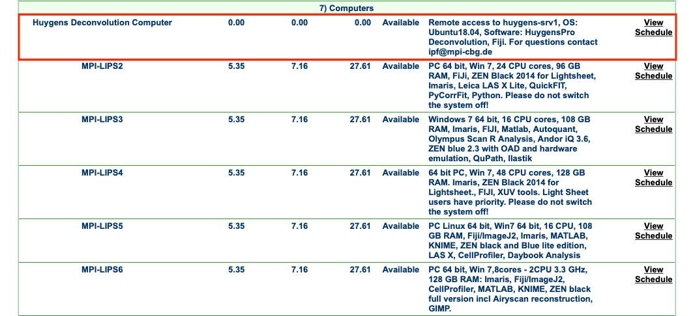

* Open Microsoft Remote Desktop.

>*CBG network* 
>*Login required*

* (a) Select the PCs tab and click on the *Add PC* button on the main window. Alternatively, one can also click on the '+' button on the top menu bar and select *Add PC*.
* (b) Enter the details.
	* PC Name: huygens-srv1.mpi-cbg.de
	* User account: In drop-down menu, select *Add User Account* and enter relevant credentials.
	* Click on *Add* button at bottom right.  

<table>
<tbody>
  <tr align="center" valign="top"> 
     <td>(a) 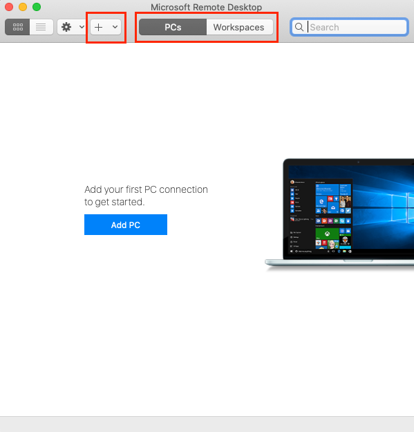</td>
     <td>(b) 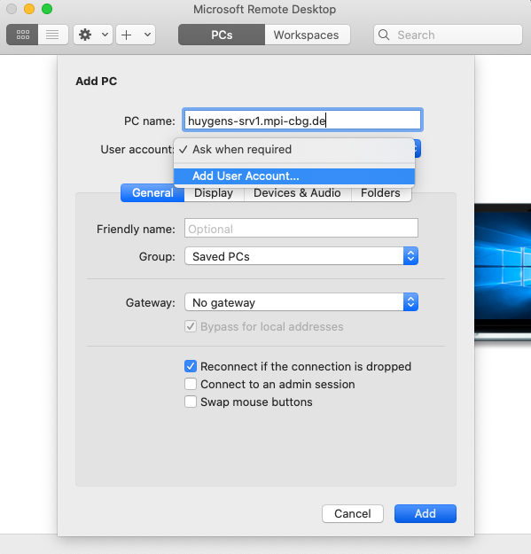</td>
  </tr>
</tbody>
</table>

* You will see a computer added to the main window. 

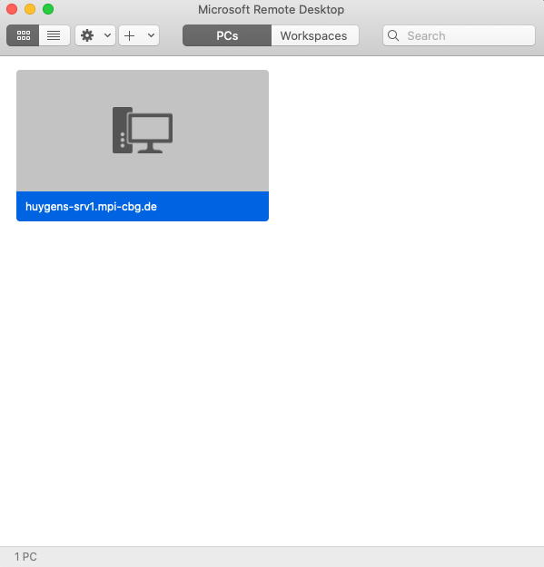

* Double click on the added PC to launch the remote desktop. If everything went well, you will have a desktop window like below.

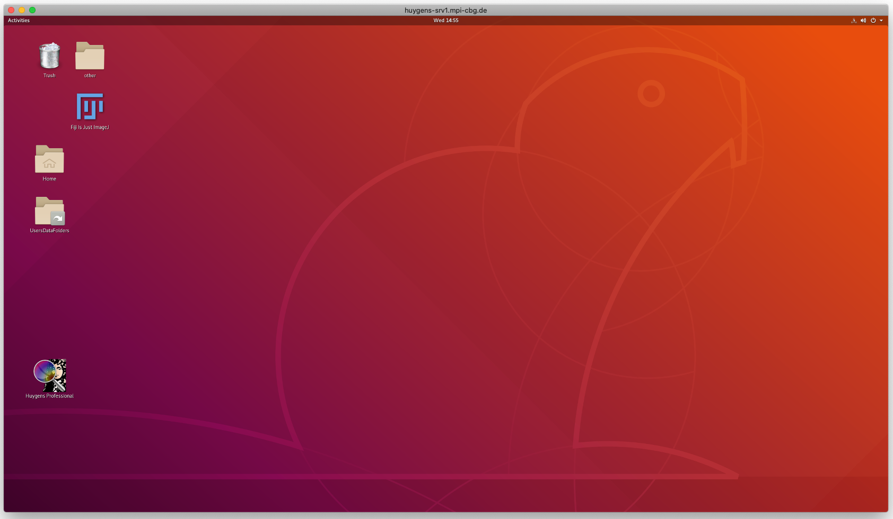

### Step 2: Launch HuygensPro 
* Launch Huygens by double-clicking on the *Huygens Professional* icon on the remote desktop.
* The main window has the following appearance. 

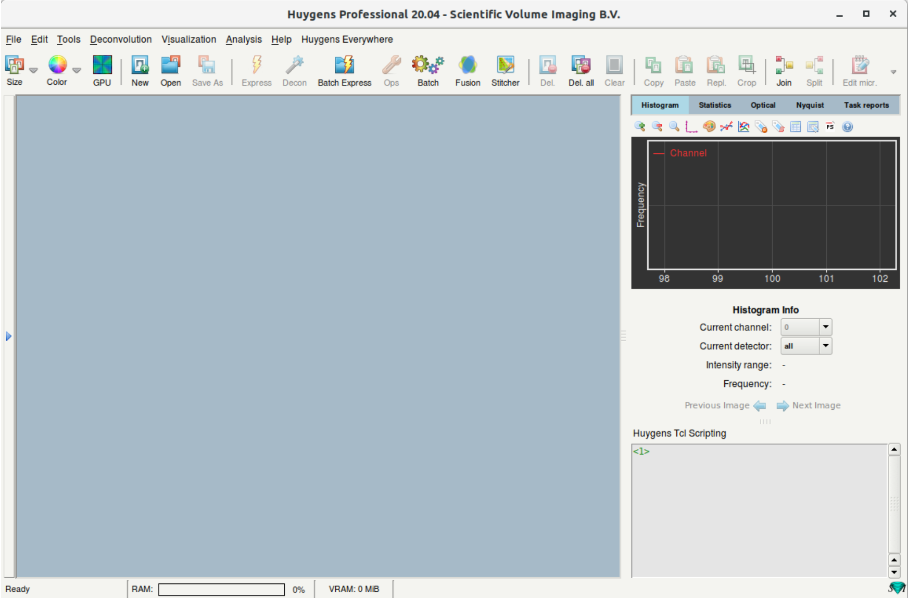

* Main sections:
   * The blue region is where you will find the thumbnails of opened images and of  processed results.
   * On the top, is a task bar, with icons to launch main functions such as deconvolution (*Decon*) and batch processing (*Batch Express*).
   * On the right, the window with multiple tabs gives you information related to the currently selected image. 

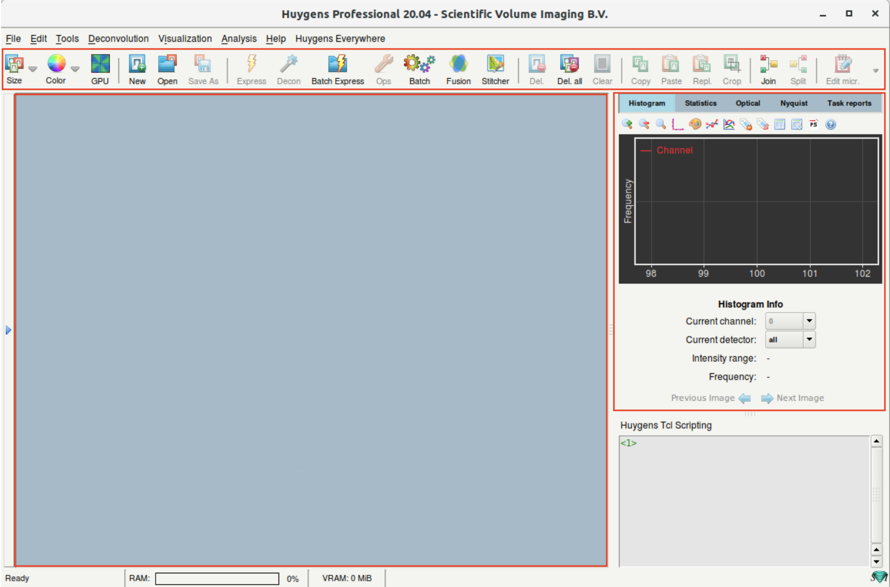

### Step 3: Open an image file
* (a) Click on the *Open* button to open an image. Alternative: *File > Open*
   * (b) On opening an LSM image, Huygens will ask for the micrsocope model used for imaging. Select the one you used for image acquisition; contact the LMF if you are not sure.
   * (c) On opening a TIF series, Huygens will ask how to interpret the individual files. Such as slices from a 3D stack, channels or time points.

<table>
<tbody>
  <tr align="center" valign="top"> 
     <td>(a) </td>
     <td>(b) 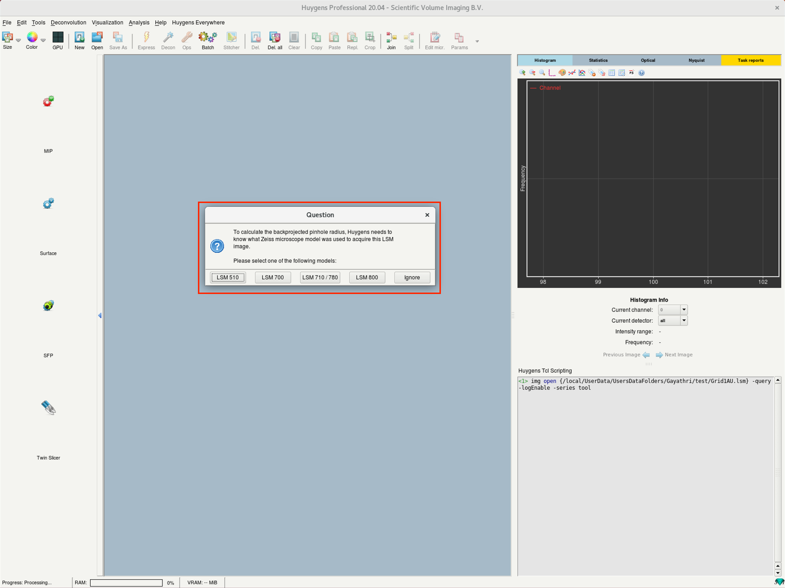</td>
  </tr>
  <tr align="center" valign="top"> 
     <td>(c) 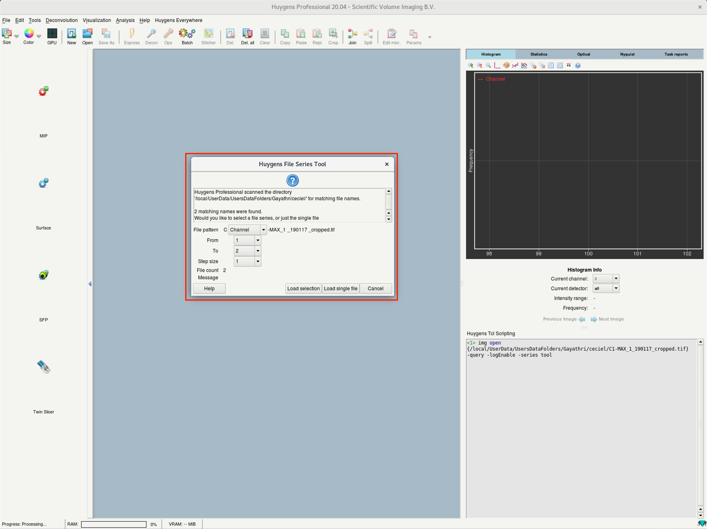</td>
  </tr>
</tbody>
</table>

### Step 4: Inspect your image
* After opening a file, you should find a new image thumbnail in the main work space.

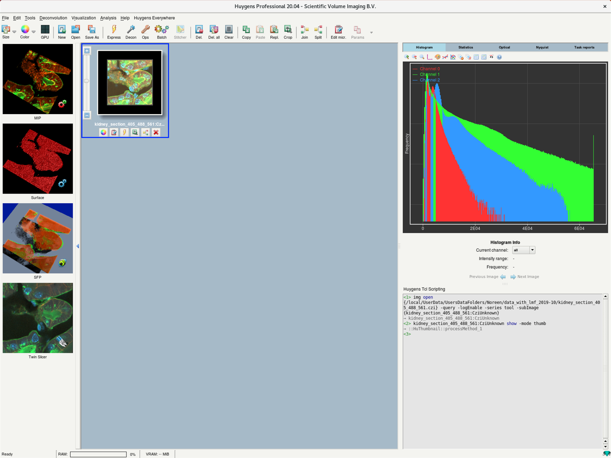

* Click on the thumbnail to select the image. 
* Once you select:
   * the right window is updated with the image histogram and other information, and
   * the windows on the left show multiple renderings of the selected image. 
* Right click on the thumbnail and select *2D Visualization > Slicer*. Alternative: *Visualization > Slicer*
* The *Slicer* view which allows you to check if the data was imported properly.

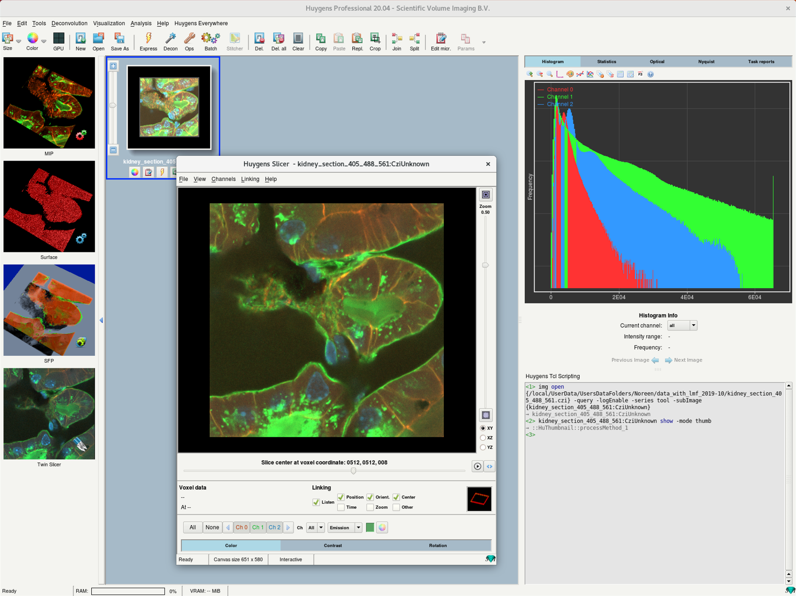

* There are controls to select any plane orientation in space (XY, YZ, XZ), zoom, scroll through slices, and view time frames (if applicable).
* Check if the image shows misalignment across the channels in case of multichannel image (chromatic aberration) or drift in Z for 3D time series.

> *Chromatic aberration can be corrected in Huygens using the menu Deconvolution Chromatic Aberration Corrector.* 
> *The z-drift corrector tool is available as a part of deconvolution post-process for 3D time-series.*

**Tip**: If the image dimensions are not loaded correctly (for example, channels are read as slices) use the option *Tools > Convert* to set the right dimensions.

### Step 5: Microscopy parameters
* For a good deconvolution result, it is **extremely** important to have accurate microscopic parameters since these values are used to compute the PSF.
* Right-click on the image thumbnail and select *Microscopic parameters*. Alternative: *Edit > Edit Microscopic Parameters*

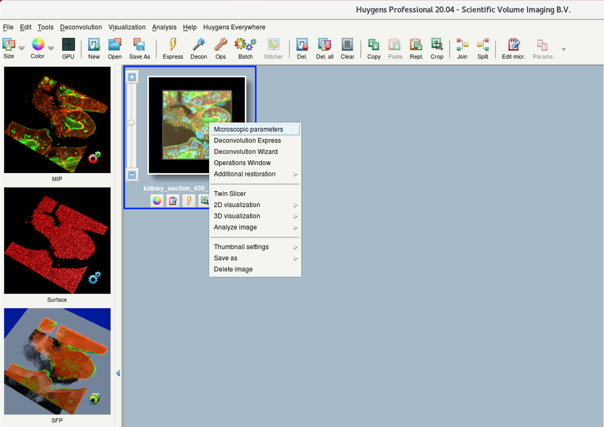

* Parameters are read from the image metadata.
* Sometimes, the values from the metadata are not read out correctly. Check and correct the parameters.

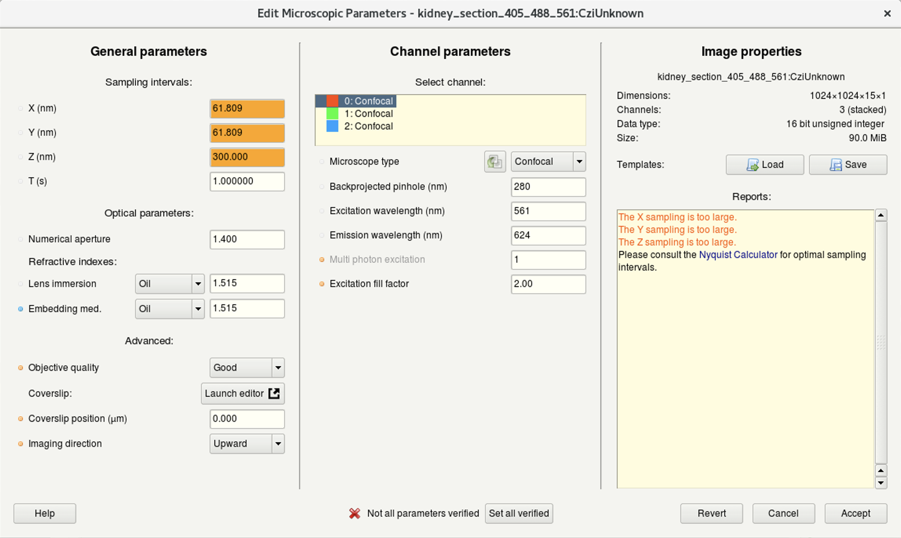

* (a) Here you can edit the general imaging parameters.
* The most important parameters are the *Sampling Intervals* which have be in a proper range for deconvolution to be possible.

> *Use the [Nyquist Calculator](https://svi.nl/Nyquistcalculator) before your image acquisition to get the sampling limits for your experiment.*  

* (b) Here you can specify the microscope type as well as the excitation and emission wavelength for each acquired channel.

> *For a bandpass emission filter you can use the center wavelength.* 
> *Multiphoton images: select Widefield and set the Multi photon excitation to 2.* 
> *For standard microscopes the Excitation fill factor = 2 or higher.* 
> *For confocal microscope data the Backprojected pinhole (nm) is usually calculated correctly from the metadata.* 

* (c) Here you can find the summary of your image data. 

<table>
<tbody>
  <tr align="center" valign="top"> 
     <td>(a) 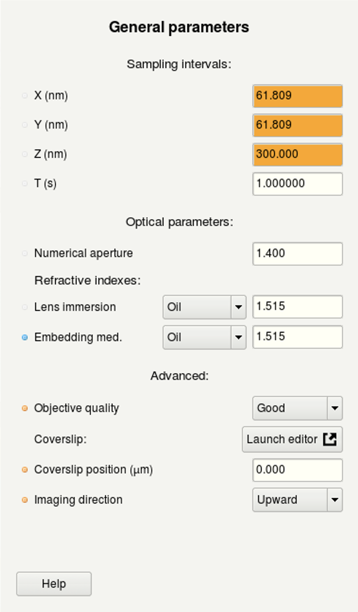</td>
     <td>(b) 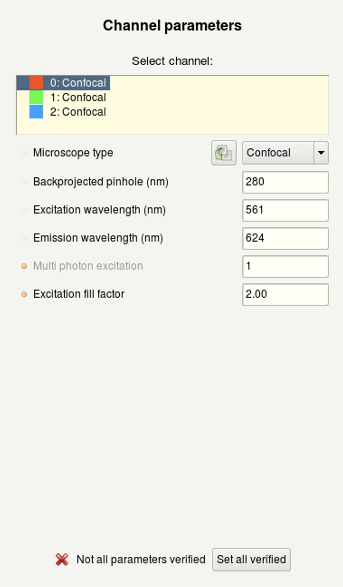</td>
  </tr>
  <tr align="center" valign="top"> 
     <td>(c) 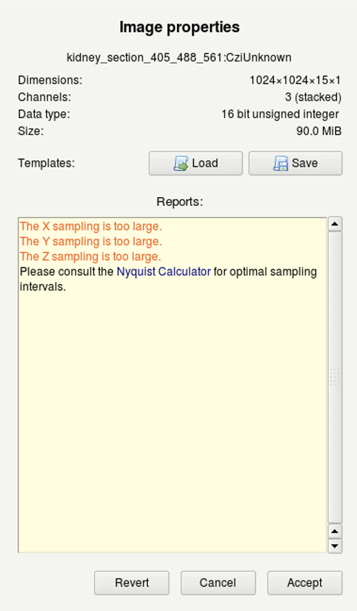</td>
  </tr>
</tbody>
</table>

* Once you have correctly set and verified the parameters, click on *Set all verified* followed by *Accept*. 

> *If you acquired multiple datasets with the same parameters, save them as a template for future use or batch processing.*  
> *The Load button serves to load a previously saved parameters template.*

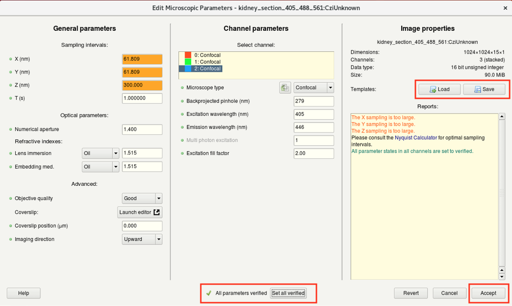

**Tip 1**: For more information on the Huygens microscopic parameters click [here](https://svi.nl/MicroscopicParameters).

**Tip 2**: Huygens uses different background colors and the *Reports* window, to give you feedback about issues with your imaging settings or parameters.   

### Step 6: Deconvolution wizard
* Right-click on the image and select *Deconvolution Wizard*. Alternative: *Deconvolution > Deconvolution Wizard* or *Decon* icon on the task bar.

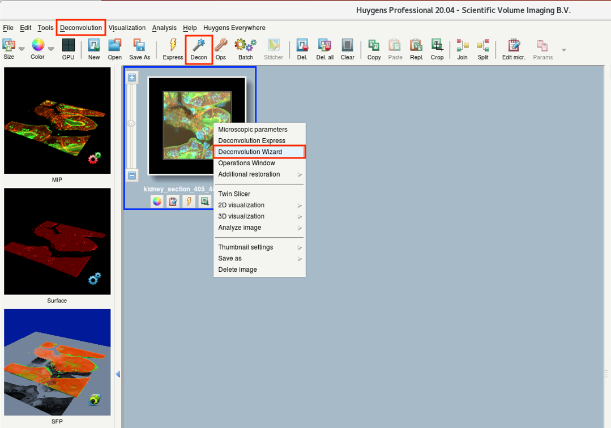

* On the start window of the wizard, you can see a summary of the previously defined paramaters. 
* The *Wizard status* window shows current status, warnings, etc.

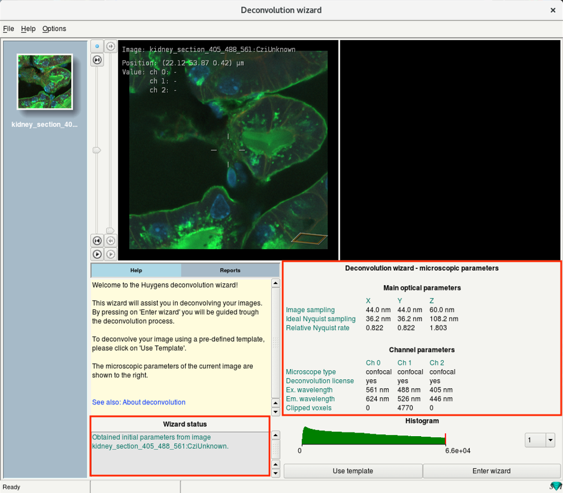

* Check if the parameters are correct and click on *Enter wizard*.

### Step 6a: Deconvolution wizard: PSF selection
* Huygens supports both measured and theoretical PSF. 

> *For thick samples, it is recommended to use theoretical PSF.*  
> *For badly aligned microscopes, better to use measured PSF.*

* In you want to use a measured PSF, the following steps apply, **before launching the deconvolution wizard.**
	* Acquire fluorescent bead images with the same acquisition settings as your raw data.
> *Use the same z-sampling or slightly higher (=more slices/um) than the biological experiment.*

	* Go to *Deconvolution > PSF Distiller Wizard* tool to compute the PSF from your bead image. 
	* Once you finish, you will find a new thumbnail of the PSF in the main window.
	* Launch the *Deconvolution Wizard*.
	* At the *PSF Selection* step, choose *Import from main window* and select your PSF image.

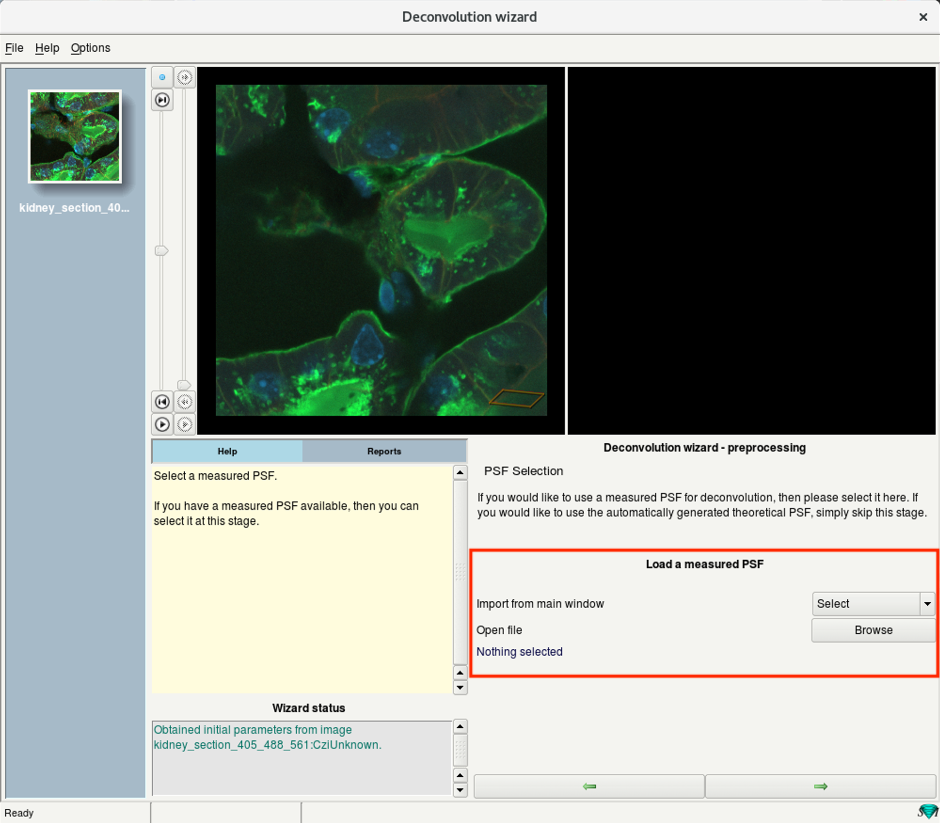

* To let Huygens calculate the PSF from your image parameters (theoretical PSF), simply press *Next* (--->).

> *Calculated PSF works well and is recommended.*

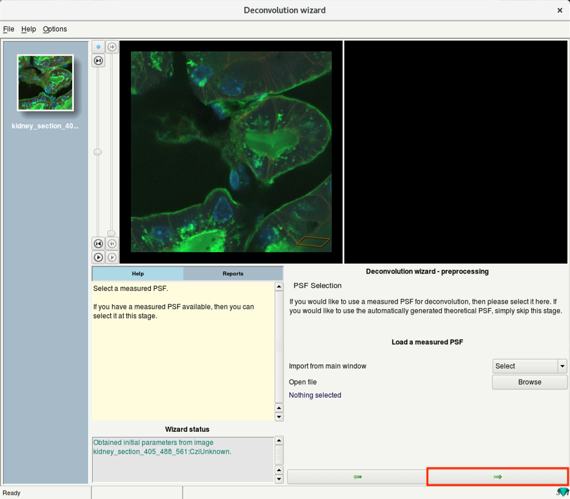

**Tip**: To know more about PSF and PSF distiller, visit [Huygens Webpage](https://svi.nl/Huygens-PSF-Distiller).

### Step 6b: Deconvolution wizard: Cropping
* Crop the 3D stack manually by using the *Launch the Cropper* option. 

> *The time needed to deconvolve an image increases proportionally with its volume.*  
> *Cropping helps to accelerate the process.*

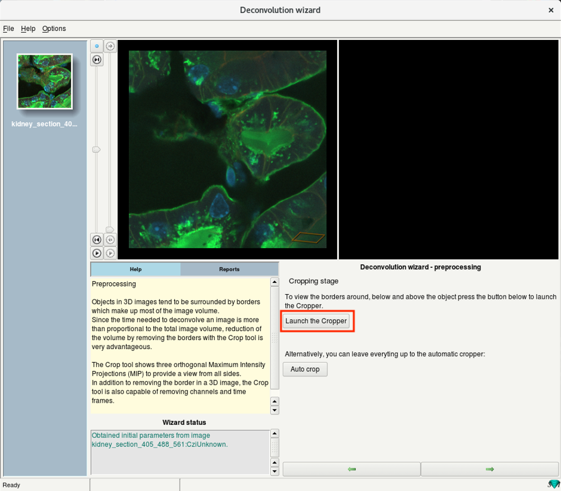

* Alternatively, one can also use the *Auto crop* to let Huygens automatically detect a suitable region of interest.
* If you launched the *Cropper*, set the region of interest by adjusting the boundaries of the bounding box.
* Press on *Crop* on the bottom right of the window.

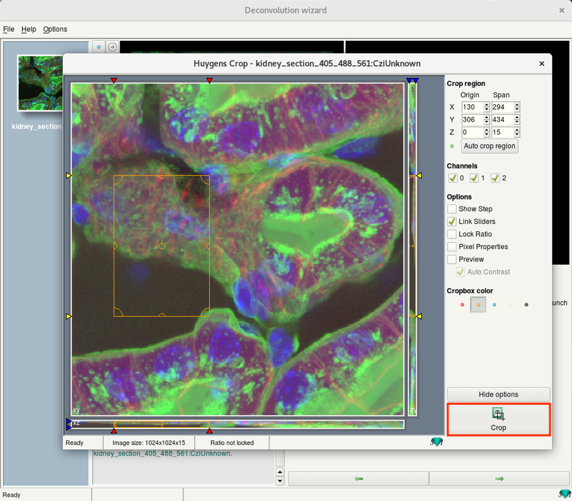

* Press *Next*.

### Step 6c: Deconvolution wizard: Select channel
* If you have more than one channel in your dataset, you will need to deconvolve them sequentially.
* On the left, you will see all the channels of your dataset.

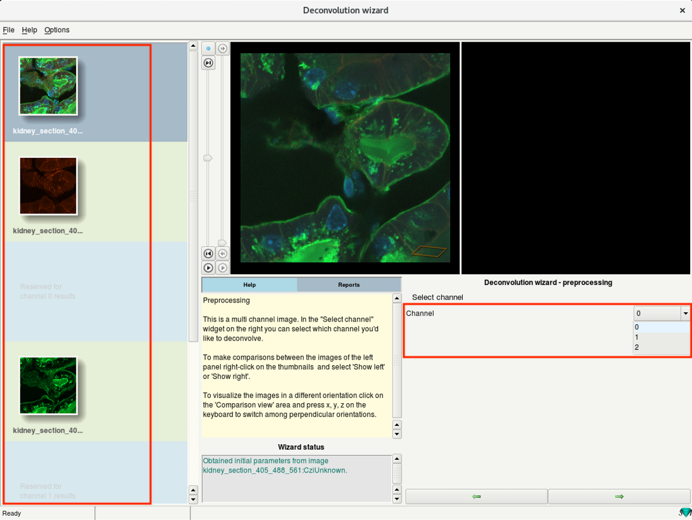

* Select the first channel from the drop-down menu on the right and press *Next*.

### Step 6d: Deconvolution wizard: Inspecting the image histogram
* In this step, you will calculate and inspect the image intensity histogram of the selected channel.
* Select *Logarithmic* and click *Compute*.

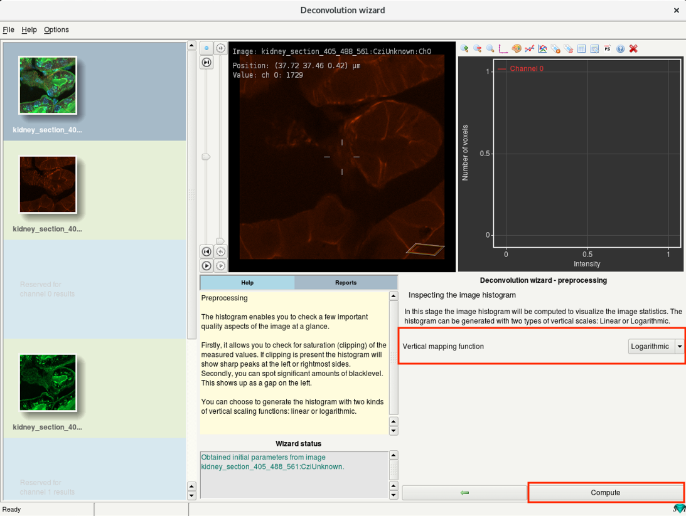

* Huygens computes the histogram and displays it on the window next to the image.
* Huygens also provides important information on the intensity distribution.

* Inspect the histogram and the report before proceeding.

> *A tall peak on the extreme right of the histogram indicates clipping or saturation.*  
> *Clipping occurs when input signals that are too high, are mapped to the highest value available by the CCD camera.*  
> *A tall peak on the very left of the histogram also indicates clipping, here the negative input signals are mapped to zero.*  
> *There can also be an offset at the left of the histogram indicating a positive blacklevel. This does not affect the deconvoluton results.*  

**Tip 1**: Save images as 16-bit to avoid clipping. 

**Tip 2**: Avoid deconvolution if there are large regions of saturated pixels. Check and make changes to your image acquisition settings. 

### Step 6e: Deconvolution wizard: Background estimation
* Estimate the background intensity of the channel. 
* There are two modes: *Automatic estimation* and *Manual mode.*
* It is **recommended to use** ***Automatic estimation***.

> *Confocal: set Estimation mode to 'Lowest'*  
> *Widefield: set Estimation mode to 'In/Near Object'*

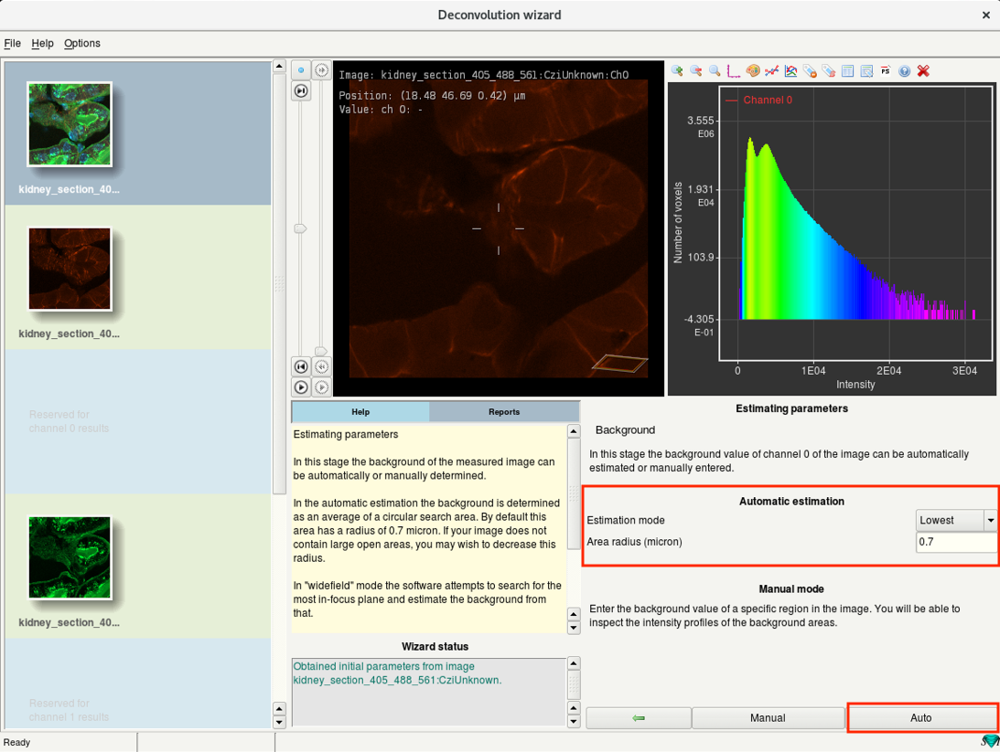

* Set the *Estimation mode* and click on *Auto.*
* To provide a background value with manual measurement, click on *Manual*.

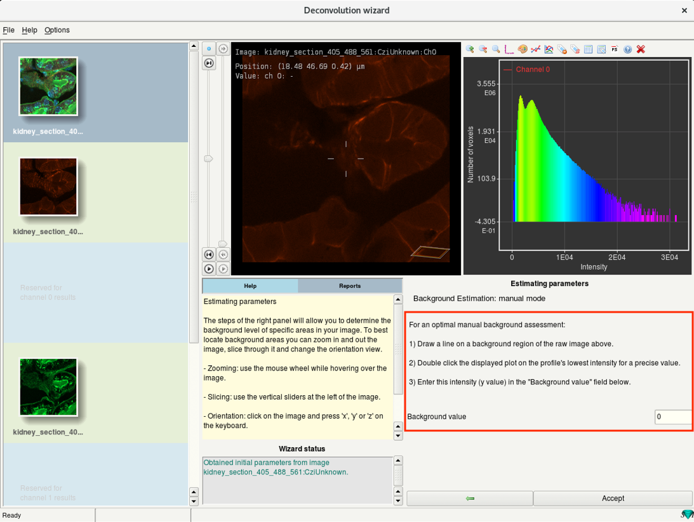

* Follow the instructions mentioned, enter the measured value in the *Background value* and click on *Accept*.

**Tip**: Use **Auto** mode for background estimation. 

### Step 6f: Deconvolution wizard: Select deconvolution algorithm
* If the *Auto* mode for background estimation was used, you will find the results here.
* Select the *Deconvolution algorithm* to be used.

> *CMLE(Classic Maximum Likelihood Estimation): Robust, default method.*  
> *GMLE(Good’s roughness Maximum Likelihood Estimaion): Good for high-noise images. Uses more memory than CMLE*  
> *QMLE(Quick Maximum Likelihood Estimation): Fast, good for low-noise images.*  

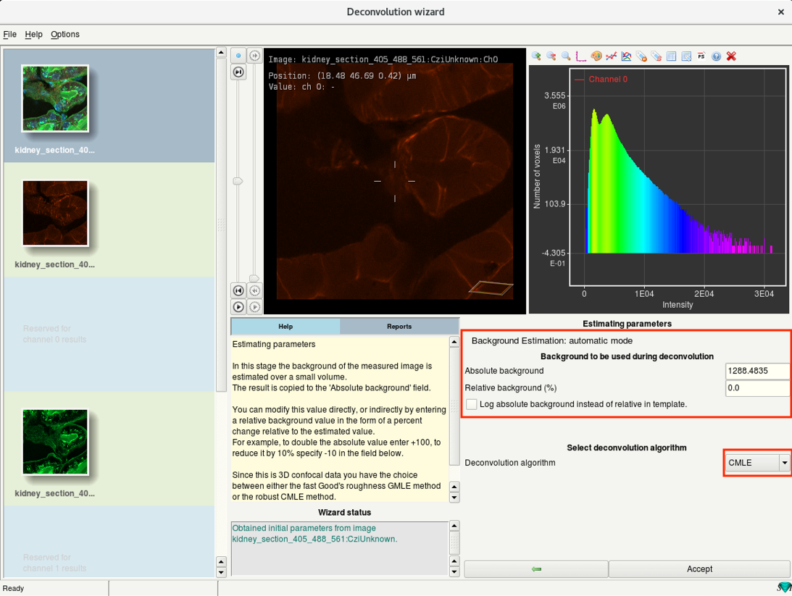

* Check the background estimate, select the deconvolution algorithm and click *Accept*.

**Tip**: **CMLE is generally recommended** for almost all kinds of images.  

### Step 6g: Deconvolution wizard: Setup deconvolution parameters
* The most important parameter that controls the deconvolution results is the Signal-to-Noise Ratio (SNR.)
* The SNR determines the sharpness of the restoration result.

> *SNR too low: harmless but no sharpening*  
> *SNR too high: causes artifacts*  
> *Noise-free widefield image: SNR approx. > 50*  
> *Noisy confocal image: SNR approx. 15-20*

* Adjust the *SNR* value.
* For the others, the defaults are set according to the image parameters and require no adjustments.

**Tip**: Check the [Huygens page](https://svi.nl/SignalToNoiseRatio) for more details.

### Step 6h: Deconvolution wizard: Preview and deconvolution
* Use the *Deconvolution preview* to check the results of current deconvolution parameters.

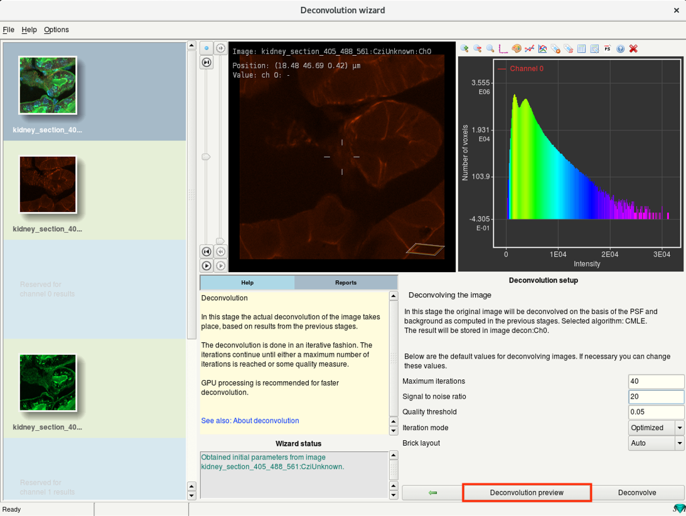

* The progress is visible in the *Reports* window on the left.
* In the image window, you can now see a yellow box which previews the result of deconvolution.

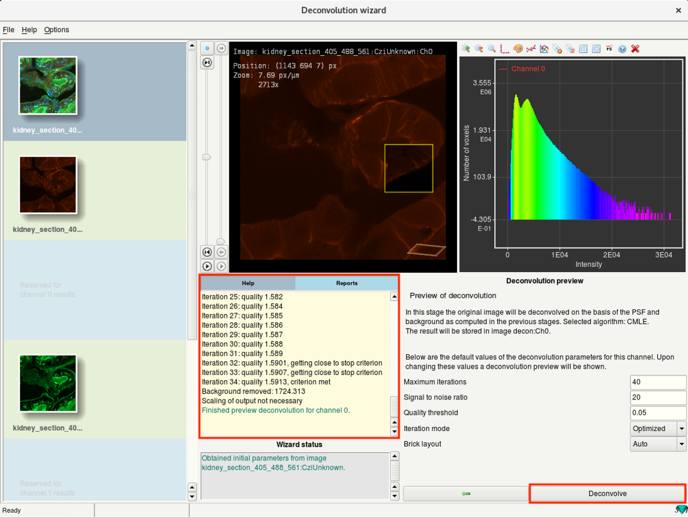

* You can move the box around to check the deconvolution preview from diffrent regions.

> *Check for artifacts. If seen, reduce the SNR and test the preview again.*  
> *If there is hardly any change in contrast, increase the SNR and run the preview.*

* If the preview looks good, click *Deconvolve*. This will start the deconvolution of the active channel.

**Tip**: Use different SNRs (20, 40, 50, 60) and perform deconvolution. Check the results and select the SNR which improves sharpness without enhancing noise.

### Step 6i: Deconvolution wizard: Deconvolution result
* When the deconvolution of your channel is done, you can see a preview of the result in the *Deconvolution result* step.
* Click *Accept, to next channel* to deconvolve the next channel of your dataset.

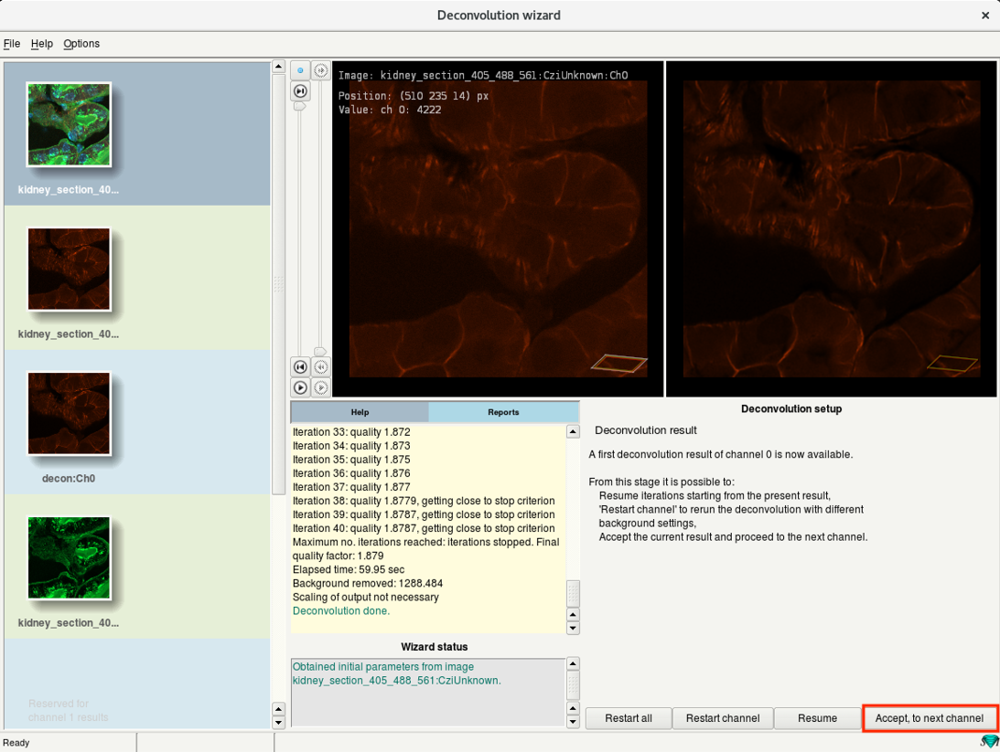

* For the next channel, the wizard starts at **Step 6c**.
* Perform a deconvolution for all channels of your dataset.
* After deconvolution of the last channel click *All done*.

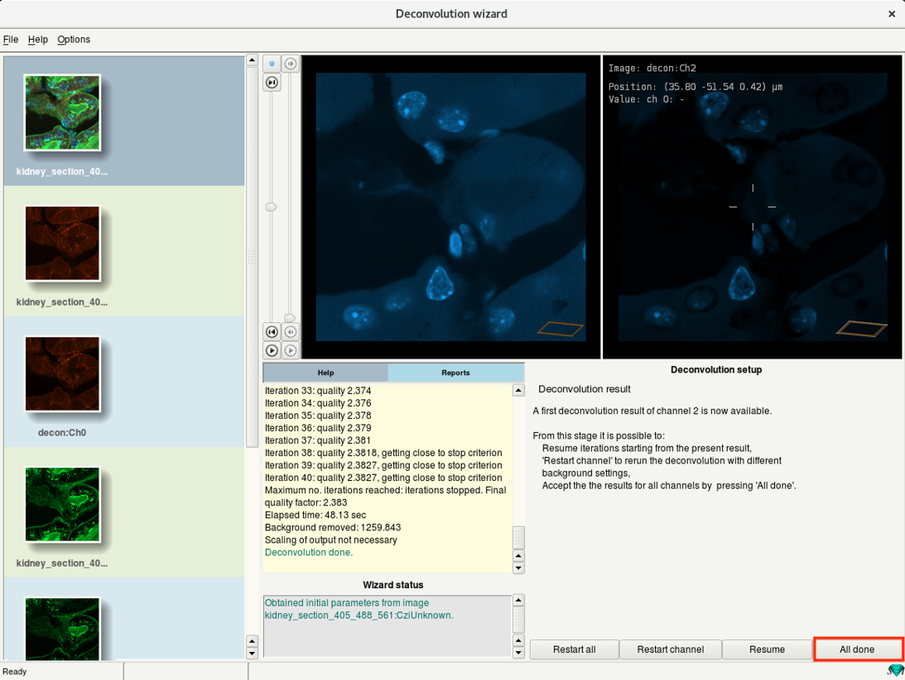

### Step 6j: Deconvolution wizard: Select the results
* You can merge the deconvolved images with the original images here.

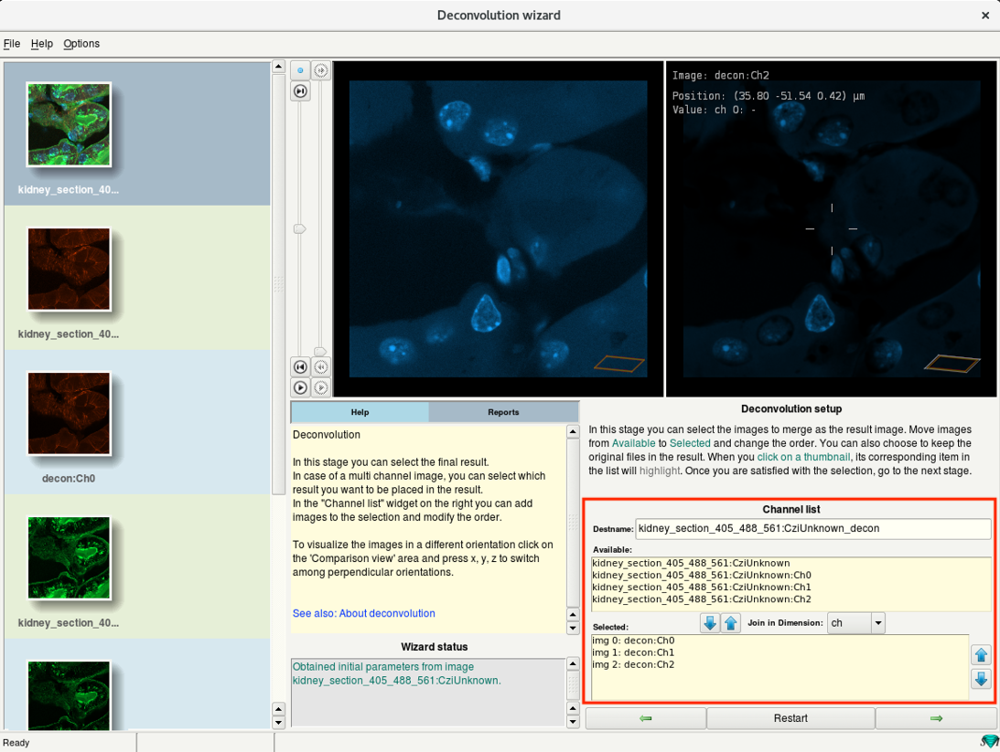

* Leave at default and click *Next*.

### Step 6k: Deconvolution wizard: Summary
* In the last step you can save your deconvolution parameters as a template. 

> *Useful if you plan to deconvolve multiple datasets of the same type.*

* Click *Done* to close the deconvolution wizard and return to the main window.

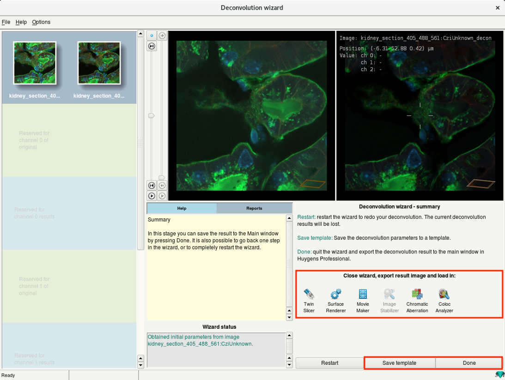

* Alternatively, click on *Twin Slicer* icon to close the wizard and export the results directly for exploration.

> *One can also go to other the postprocessing steps such as Chromatic Aberration correction by clicking relevant icons.*

### Step 6l: Explore your results
* If you clicked *Done* in the previous step, you will return to the main window where you will see a new image thumbnail of the deconvolution result.
* Right-click on the thumbnail and select *Twin Slicer*.

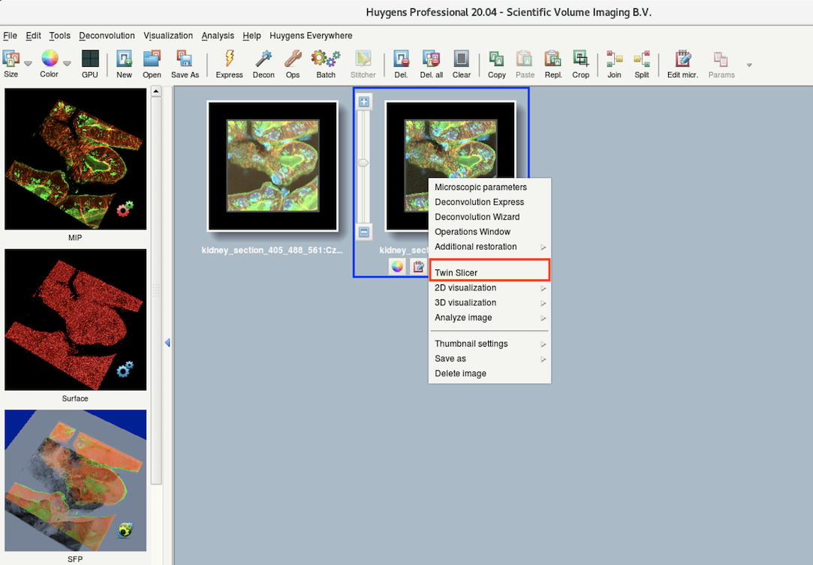

* Use the drop-down menu to select your raw dataset on the left and deconvolved dataset on the right.

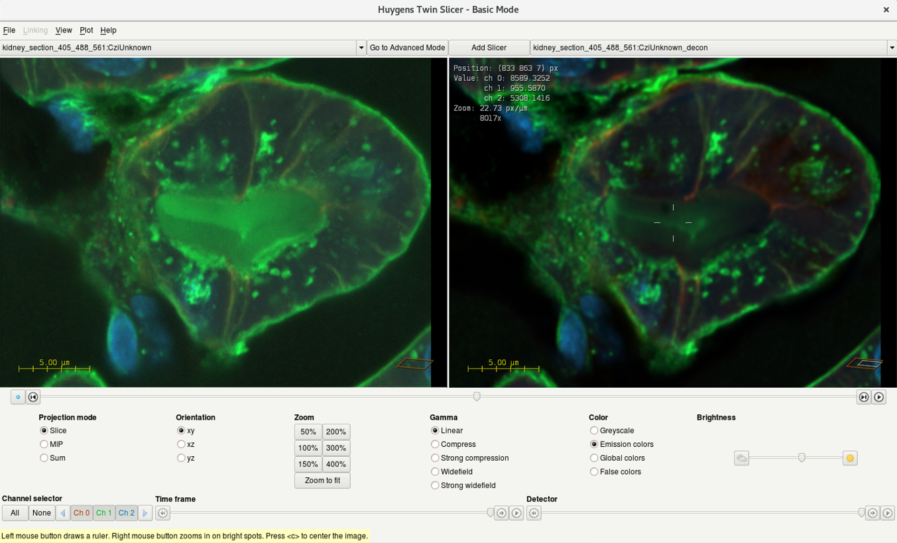

* Compare the deconvolution result with the raw dataset.

### Step 6m: Saving your results
* **Do not forget to save images** before closing Huygens.
* Right-click the result image thumbnail and select *Save As*.

> *Recommended file-formats for saving: ICS2, TIFF 16-bit.*

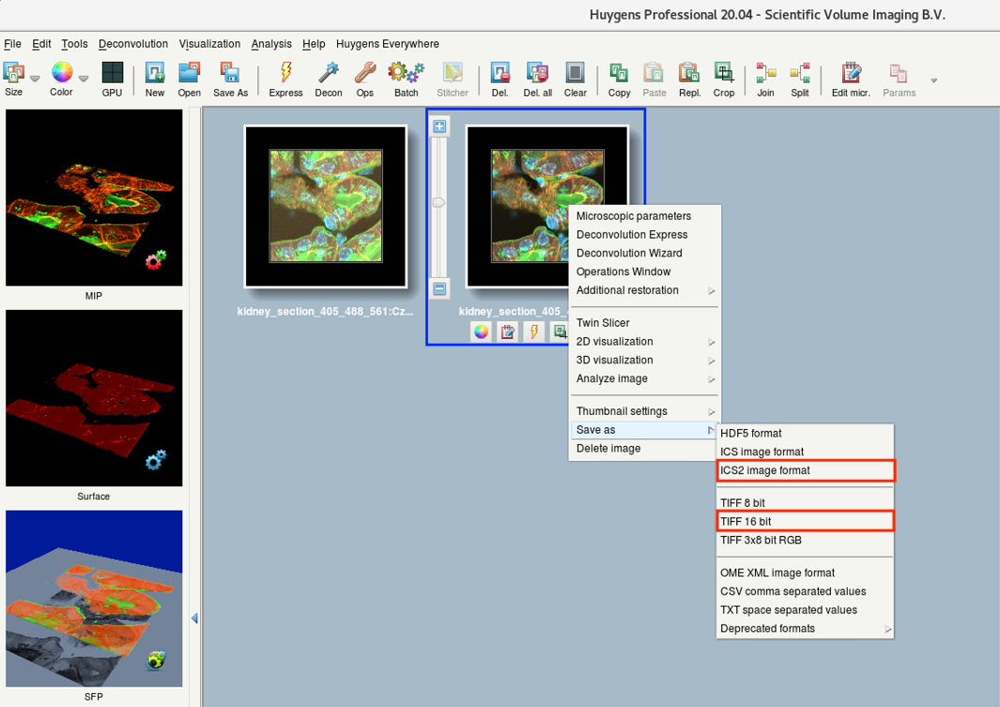

* A *Question* dialog asks you how you want to save your files. Usually *One per channel* is sufficient.

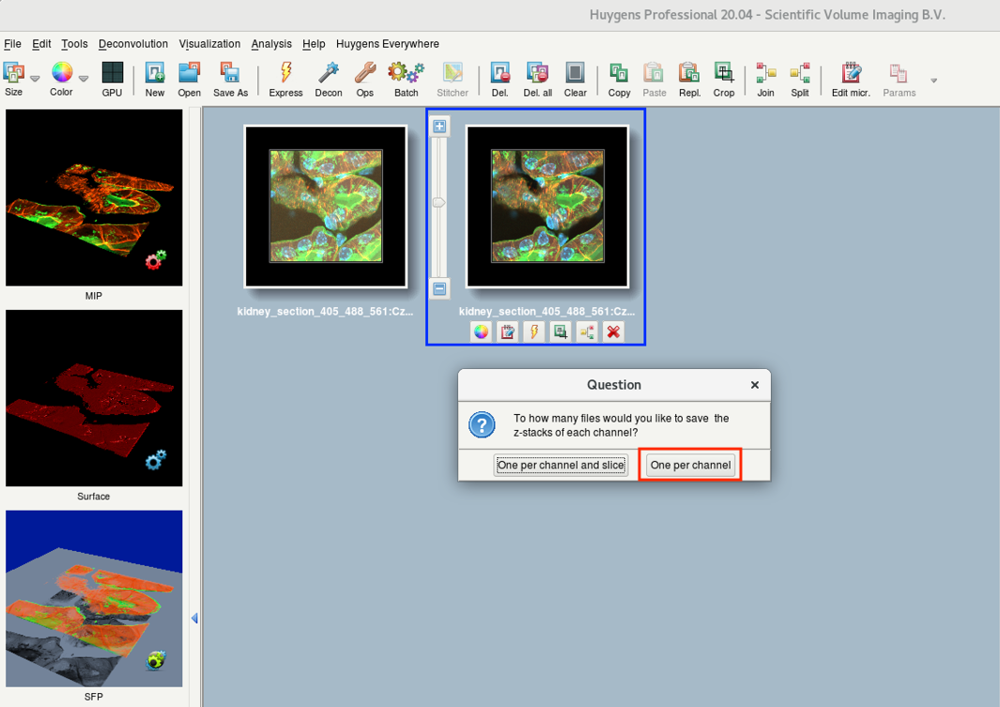

* Depending on the choosen file format and the intensities in your data, Huygens might also ask about the conversion mode.

> *Contrast stretch: good for visualization purposes and further analysis such as colocalization*  
> *Linked scale: use if you plan to perform ratiometric analysis.*

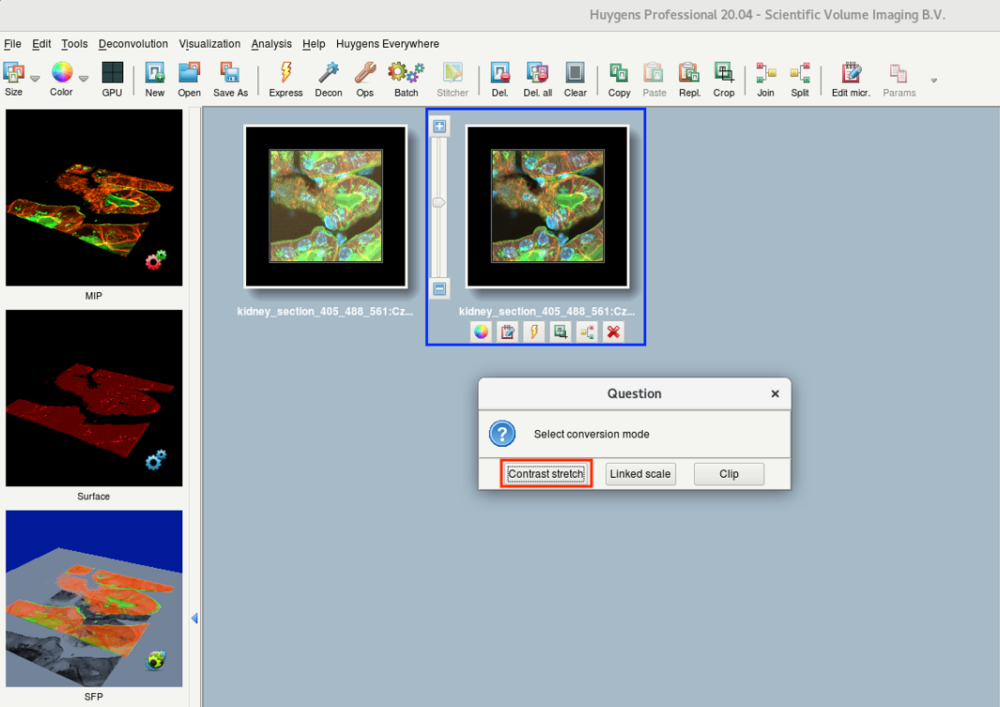

**Tip**: Check the [Huygens webpage](https://svi.nl/TiffScaling) for more details on saving images as TIFF.

### Step 7: Quit Huygens
* Quit Huygens after usage by *File > Quit*. 

### Step 8: Logout
* Once you quit Huygens, you will return to the desktop of the remote machine.
* **Do not shut-down the computer**.
* Safely logout from the system using the ***drop-down next to the power button*** *> lmfuser > Log out*.

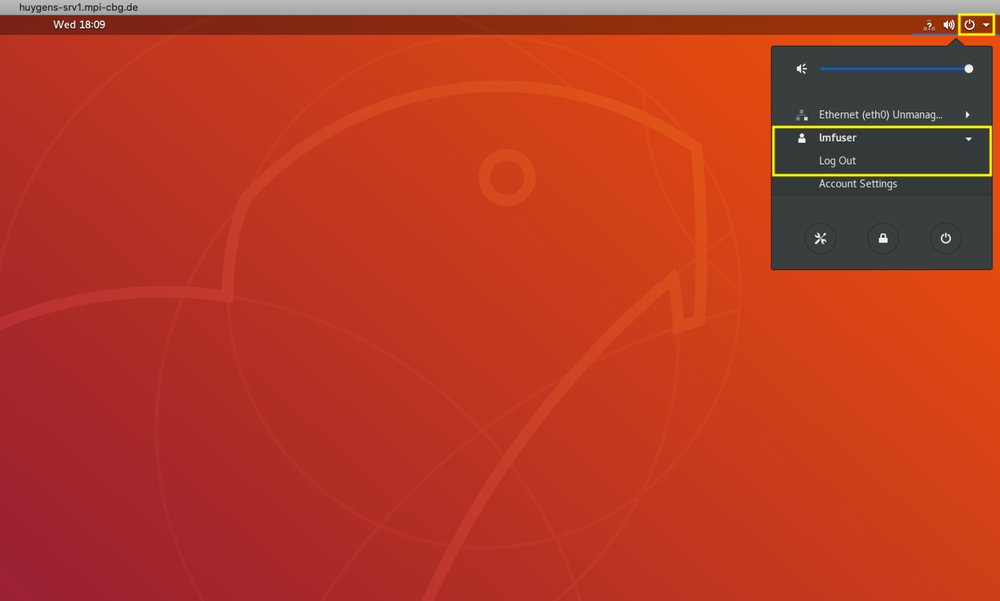

## Tips & Tricks
* Use the [Huygens WIKI](https://svi.nl/Huygens-Imaging-Academy) for details on various topics. The pages are also linked above wherever required.

## Alternatives
ImageJ/ FIJI plugins

* [**DeconvolutionLab2**](http://bigwww.epfl.ch/deconvolution/deconvolutionlab2/)
* [**DeconvolutionLab**](http://bigwww.epfl.ch/deconvolution/deconvolutionlab1/) 

Proprietary software

* [**Imaris**](https://imaris.oxinst.com/products/imaris-single-full)
* [**Volocity**](https://quorumtechnologies.com/volocity/volocity/suite)

