# Ilastik Pixel Classification
{: .d-inline-block }

Ilastik
{: .label .label-green }

## Introduction
[Ilastik](https://www.ilastik.org/) is a software that leverages machine learning algorithms for image analysis tasks. The software is interactive and easy to use and no prior machine learning expertise is required.

Ilastik provides **multiple workflows**:
* Pixel classification
* Object classification
* Tracking
* Density counting
* Semi-manual 3D carving

This how-to guide is about **pixel classification** which is used for **image segmentation**. The user labels several regions in the image interactively with a brush tool. Based on the features of these labelled regions (intensity, gradient, etc.) the software then learns to predict the segmentation for the rest of the image. A random forest classifier is used in the background to learn the prediction from the labels.

For a full documentation of Ilastik please see the [Online Ilastik Documentation](https://www.ilastik.org/documentation/index.html).

## Step-by-step
> *Prerequisite: Download and install **Ilastik** from [here](https://www.ilastik.org/documentation/basics/installation.html).*

The example data for this guide is a series of 2D TEM images but the same steps can be applied to 3D data.

### Step 1: Set up project
* Open Ilastik.
* Select: *Create New Project > Pixel Classification.*
* Save the project.

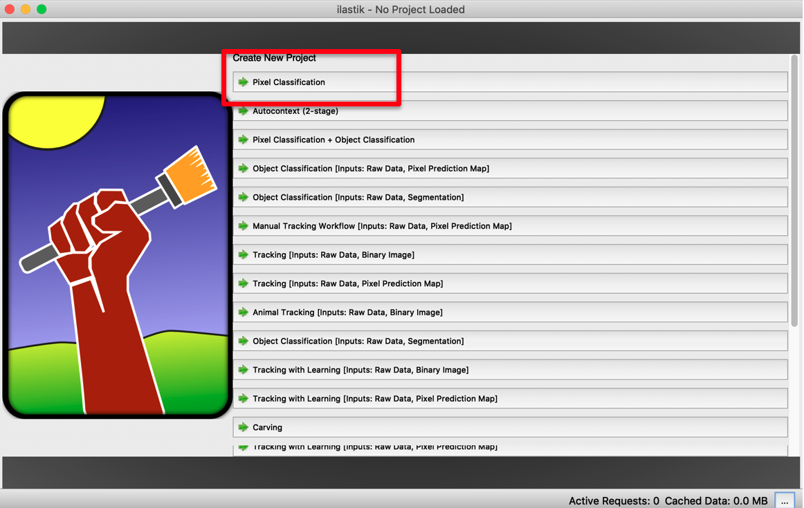

### Step 2: Define input data
* Make sure ***Input Data*** tab is selected.
* (a) Drag & drop an image into the white area.
* (a) Alternative: Click *Add New … > Add separate Image(s)...*
> *This tutorial uses only one image for training but one can (and it is recommended) to add more images for training.*

* (b) The image should appear in the list and be displayed.
* (c) Copy the image into your Ilastik project: 
	* Double-click the line with the image to open the *Properties* window.
	* Under *Storage*, select *Copy Into Project File*.
	* This menu also allows you to adjust more image properties (brightness, channels, ...).
> *If your images are big don’t copy the data. Instead make sure that you keep your training images close to the project location (like in a subfolder).*

<table>
<tbody>
  <tr align="center" valign="top"> 
     <td>(a) 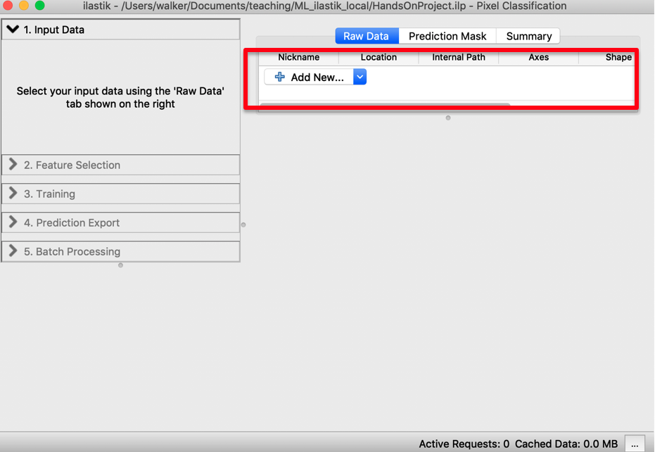</td>
     <td>(b) 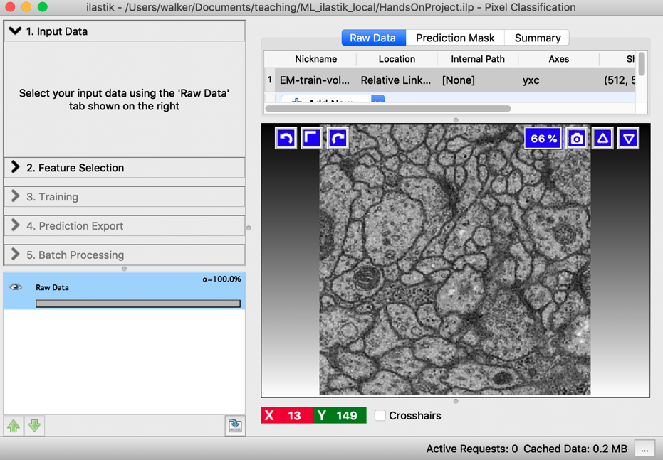</td>
  </tr>
  <tr align="center" valign="top"> 
	<td>(c) 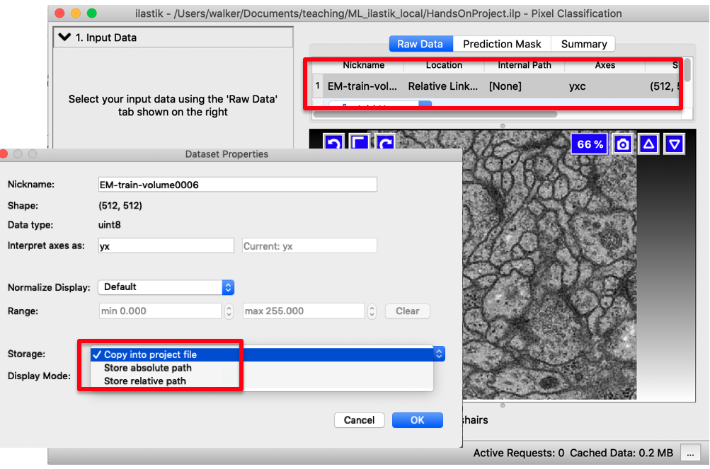</td>
  </tr>
</tbody>
</table>

### Step 3: Feature selection
* (a) Select ***Feature Selection*** tab.
* (a) Click on *Select Features* button.
* (a) Select a subset or all features.
> *Choose features from each category. The choice is initially a bit random and can be refined later.* 
> *The more features are selected, the longer the computation takes.* 
> *Larger sigma: detects bigger structures, but also computationally more expensive.*

* (b) *Optional*: Visualize the features: Visualization helps indicate which features are useful.

<table>
<tbody>
  <tr align="center" valign="top"> 
     <td>(a) 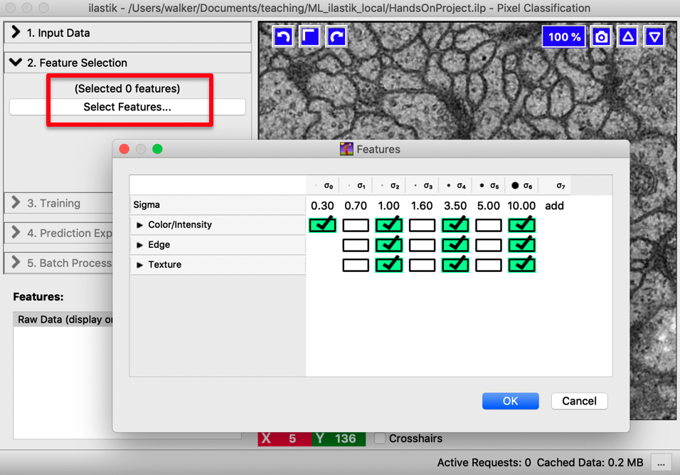</td>
     <td>(b) 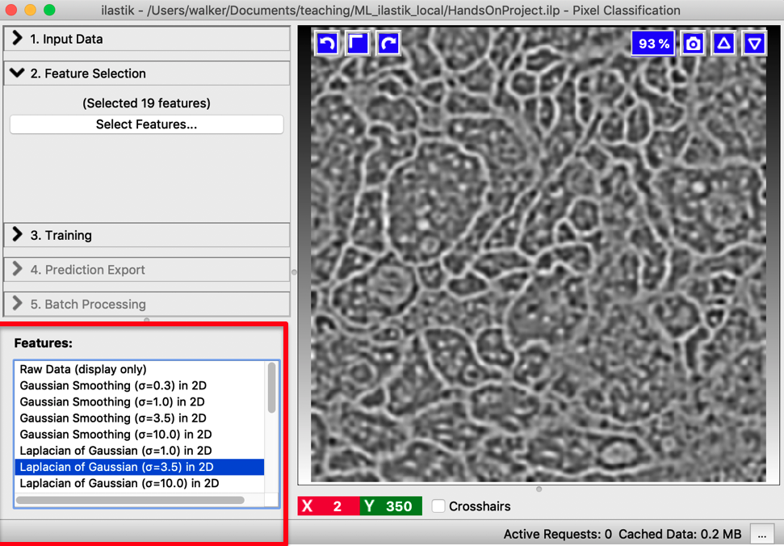</td>
  </tr>
</tbody>
</table>

### Step 4: Training
* Select ***Training*** tab.
* (a) Double-click on the colored Labels to give more descriptive names to your classes (e.g. *cells* and *background*). Optionally add more labels.
* (a) Use the brush tool to paint some regions for each class in the correct label color. This process is called "ground truth creation".
> *Basic Navigation: 
> Mouse: Zoom: Cmd/Ctrl+wheel, Pan: Shift + left button  
> Keyboard: Zoom: +/-, Pan: arrows keys*

* (b) Start the training by pressing *Live Update*.
* The classifier trains based on your labelled regions and shows the predictions as overlay.
> *If needed, change brightness & contrast (blue arrow in (b), a right click resets the display range). Alternatively, right-click on the image in group visibility Tab > Adjust thresholds.* 
> *Group Visibility tab (see (b)): Switch between probability and segmentation overlay. Change overlay transparency with the slide.*

<table>
<tbody>
  <tr align="center" valign="top"> 
     <td>(a) 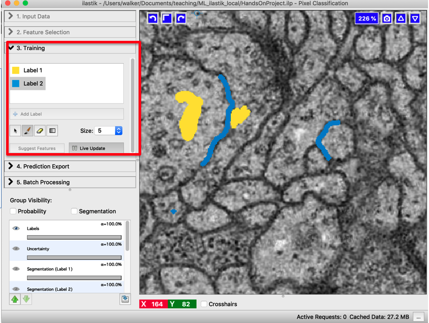</td>
     <td>(b) 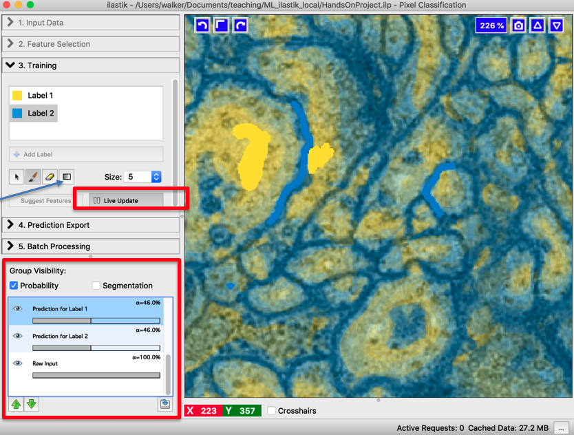</td>
  </tr>
  <tr align="center" valign="top"> 
  <td colspan="2"> (c)  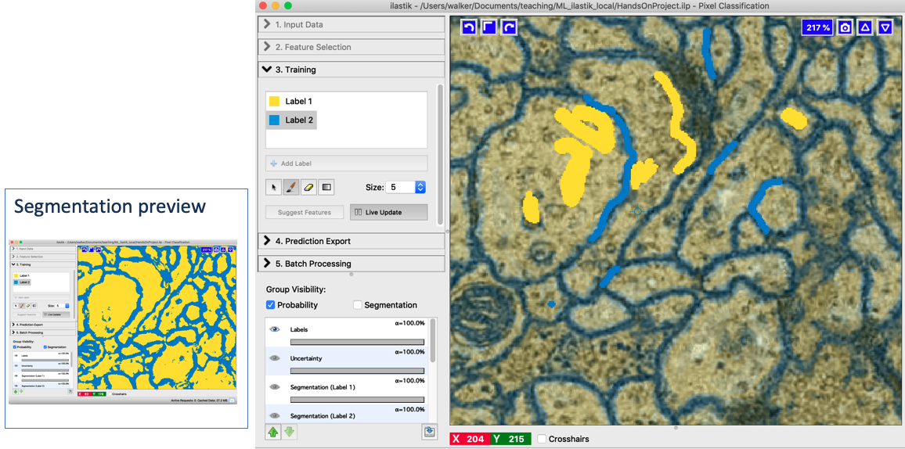 </td>
  </tr>
</tbody>
</table>

* (c) If prediction is not good, paint more regions. This increases the number of training pixels.
* If preview is slow uncheck the *Live Update*  while drawing.
* (c) Check the improved prediction after labelling more regions.
* **Don't forget to save your project regularly**: *Project > Save Project...*.

### Step 5: Optional: Optimize training
* (a) If predictions are still not good, investigate your feature selection:
	* Select *Suggest Features* (uncheck *Live Update*)
	* Compare the predictions and choose the best feature set.
* (b) The uncertainty layer can also give you an indication which extra regions are good to label.

<table>
<tbody>
  <tr align="center" valign="top"> 
     <td>(a) 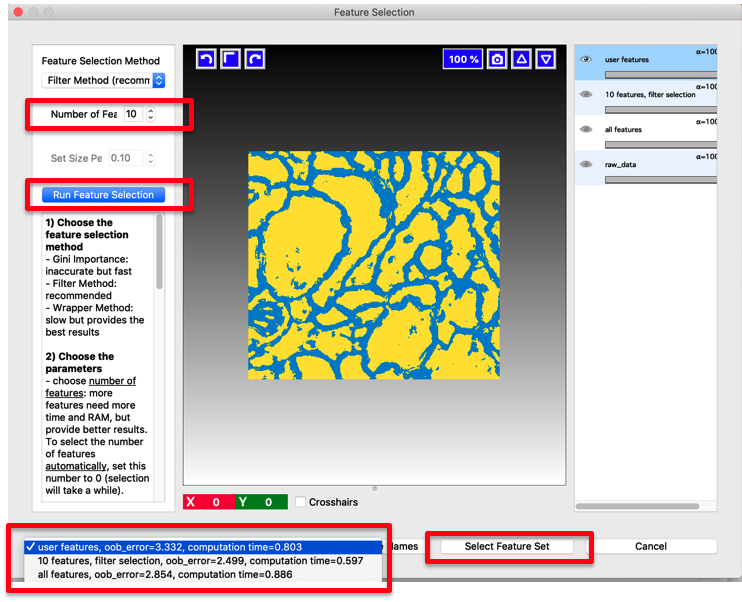</td>
     <td>(b) 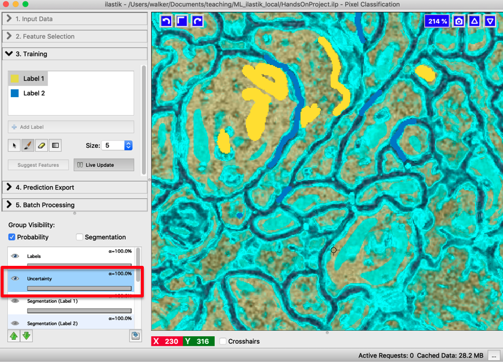</td>
  </tr>
</tbody>
</table>

### Step 6: Export predictions
Predictions can be exported as *probabilities* or *simple segmentation*. **Exporting as probabilities is recommended** as it provides more flexibility for downstream steps in tools like Fiji or python (for example: smoothing).
#### **Export Probabilities**
* Select ***Prediction Export*** tab.
* (a) Select Source: *Probabilities*, then press *Choose export image settings*. 
* (b) Choose these settings:
	* 2D image: 
		* *Format: tif sequence*
		* *If getting export error message*: Select *Transpose axis order: cyx*
	* 3D image:
		* *Format: multipage tif sequence*
		* *If getting export error message*: Select *Transpose axis order: czyx*
	* *File*: optionally append the path with a */output/* subfolder
	* Verify under *Description* that we get one image per label class ("c").
	* Then press *OK* to close the window.
* (c) Press *Export*.
* (d) The created images can be opened in Fiji.
> *If the images seem black adjust the contrast to [0,1]: Image > Adjust > Brightness/Contrast*

<table>
<tbody>
  <tr align="center" valign="top"> 
     <td>(a) 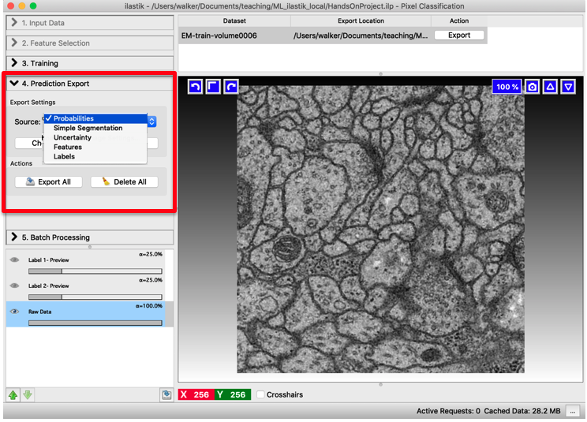</td>
     <td>(b) 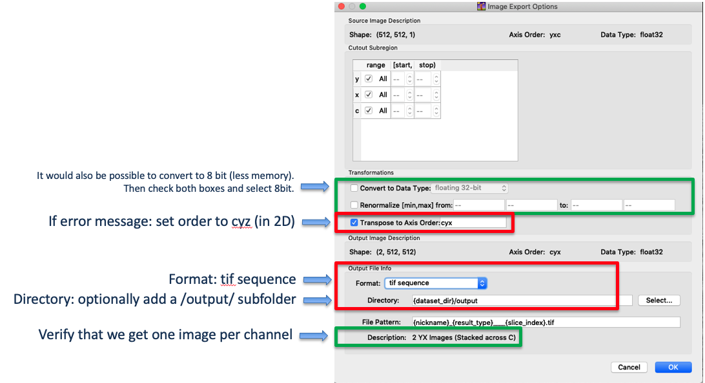</td>
  </tr>
  <tr align="center" valign="top"> 
     <td>(c) 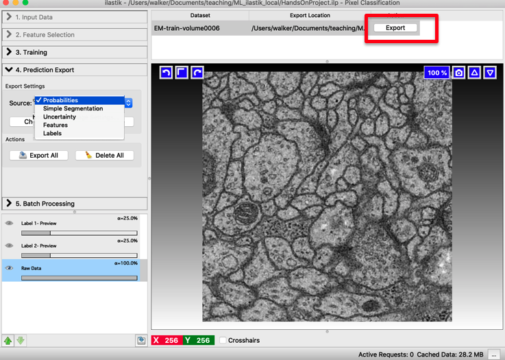</td>
     <td>(d) 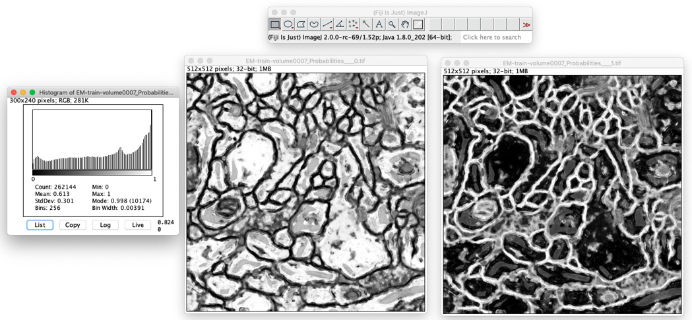</td>
  </tr>
</tbody>
</table>

#### **Export simple segmentation**
If the segmentation is very simple, a direct segmentation export may be enough (and is easier):
* Select ***Prediction Export*** tab.
* Select Source: *Simple Segmentation*, then press *Choose export image settings*.
* (a) Choose these settings:
	* *Format: tif*
	* *File*: optionally append the path with a */output/* subfolder
	* Then press *OK* to close the window.
* Press *Export*.
* (b) The created images can be opened in Fiji.
> *If the images seem black adjust the contrast to [0,2]: Image > Adjust > Brightness/Contrast*
<table>
<tbody>
  <tr align="center" valign="top"> 
     <td>(a) 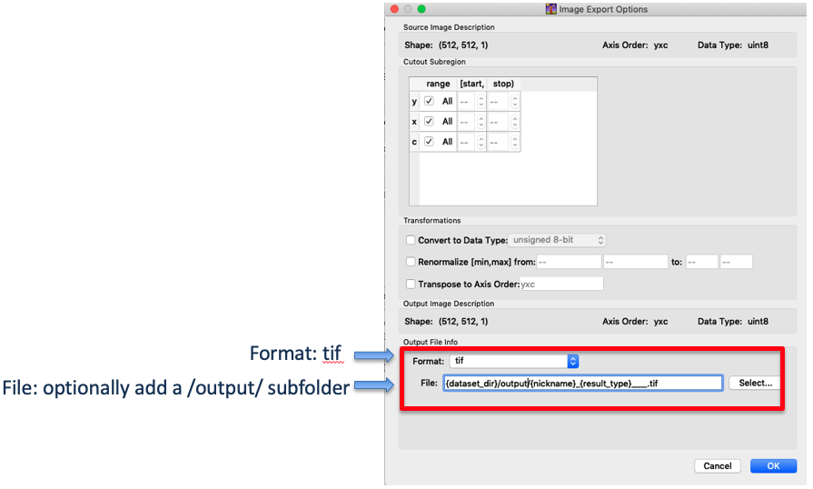</td>
     <td>(b) 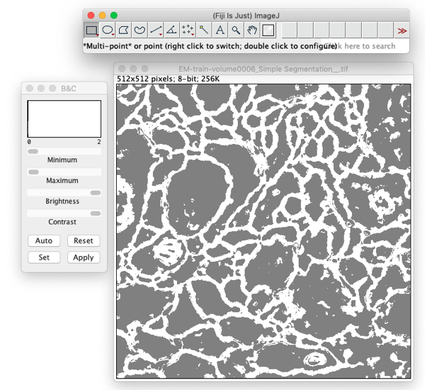</td>
  </tr>
</tbody>
</table>

### Step 7: Batch processing
* To make predictions for all your images (which were not used during training), select the ***Batch processing*** tab.
* (a) Click *Select Raw Files...* and browse for your images.
* (b) Press *Process all files* to start batch prediction.
<table>
<tbody>
  <tr align="center" valign="top"> 
     <td>(a) 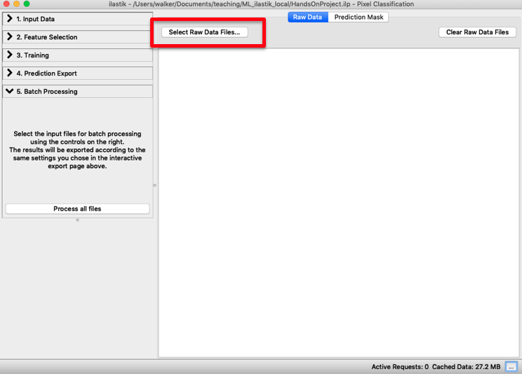</td>
     <td>(b) 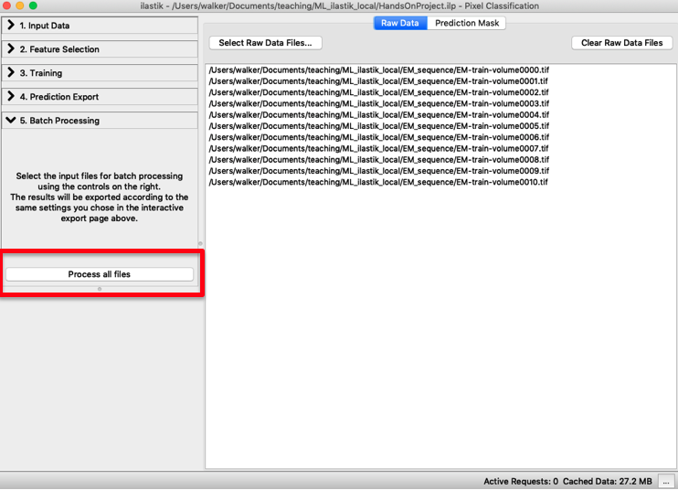</td>
  </tr>
</tbody>
</table>

## Tips & Tricks
* If images have **high variability**:
	* Train on representative subset
	* Standardize images beforehand (e.g. histogram equalization, normalize to robust min/max)
* If **objects are touching** it is helpful to introduce an "object border" class and assign a thin line around the object to this class.
* Importing results into Fiji: if error, use **BioFormats** importer.
* There are lots of options for post-processing the exported **probability map** in Fiji:
	* Optionally initial smoothing
	* Can set custom threshold value
	* Can combine different classes (if >2 classes)
* Ilastik also has a **Fiji plugin**:
	* Convert data to their favorite format (hdf5)
	* Run Ilastik pipeline from Fiji.

## Alternatives
Two Fiji plugins work with similar segmentation algorithms and labelling+prediction workflows as Ilastik:
* [**Trainable Weka Segmentation**](https://imagej.net/Trainable_Weka_Segmentation)
* [**Labkit**](https://imagej.net/Labkit)
