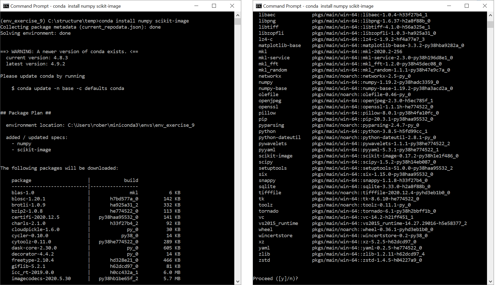
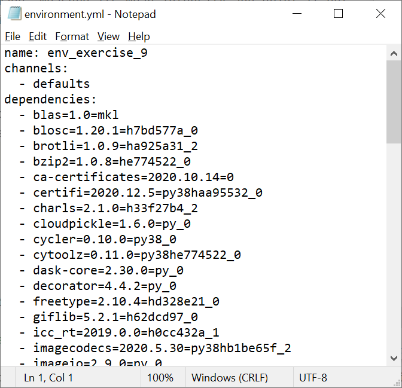
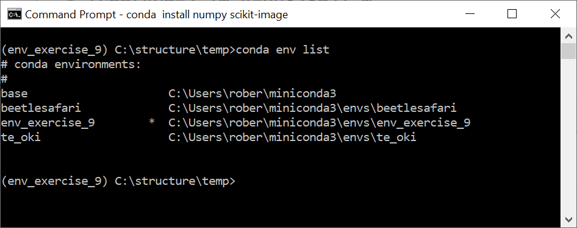

# Python / Conda Environments
{: .d-inline-block }

Python
{: .label .label-green }


## Introduction
Image data analysis using Python programming gains increasingly attention by life scientists. 
This guide gives a short introduction on how to setup a python environment and links to online resources for getting
started with image analysis in python. 
You will learn how to create so called conda environments, execute image data analysis projects in there and how to share them with collaborators.
It is also available as [online lecture](https://youtu.be/MOEPe9TGBK0).

## Step-by-step
Using Python for data analysis poses additional opportunities in the context of reproducible science and good scientific practice.
It is possible to fully document analysis workflows ranging from loading a raw microscopy image, its processing, statistical analysis, to plotting.
As a data scientists, you will use many software tools and libraries for analysing and visualising data. 
In to allow others to reproduce your workflow, the tools used and their software versions must be documented in detail. 
Therefore, it is necessary to follow some general guidelines.

### Step 0: Install your Python/Conda environment
For later extraction of a list of software you used for your analysis, it is necessary to setup a so called "conda environment" which 
is technially your workspace for a given project. Download and install conda, for example mini-conda 
[for Windows](https://docs.conda.io/en/latest/miniconda.html#windows-installers), 
[for Linux](https://docs.conda.io/en/latest/miniconda.html#linux-installers) or
[for MacOS](https://docs.conda.io/en/latest/miniconda.html#macosx-installers).

For ease-of-use, it is recommended to add conda to the PATH variable during installtion, e.g. by checking this checkbox:


### Step 1: Starting conda

After installation, you can start conda from the terminal or command line like this:

```
conda activate
```

You will then see the term `(base)` at the beginning of each line:


### Step 2: Creating a conda environment
You can create a conda environment with this command:
```
conda create ––name env_exercise_9
```

In some projects, you may want to start using python right away. Thus, yuo can specify to install python in a given version to your new conda environment from the start:
```
conda create -n env_exercise_9 python=3.8
```

And afterwards you can enter the environment like that:
```
conda activate env_exercise_9
```

**Tip**: It is recommended to create one environment for every project you are executing. 
In that way installed software libraries and tools cannot harm each other.


### Step 3: Installing software tools and libraries
Assuming we want to analyse an image, it makes sense to install two python libraries: [Numpy](https://numpy.org/) and [scikit-image](https://scikit-image.org/). 
We can do that using the `conda install` command:

```
conda install numpy scikit-image
```

As you can see, these two libraries come with many useful libraries and tools for image and data analysis:



### Step 4: Analyse an image using python
As a very simple image analysis task, we will load an image, measure its mean intensity and print it out. 
We do that in a python file called [blobs_analyis.py](pics/python_conda_environments/blobs_analysis.py)


### Step 5: Sharing code and the conda environment
Obviously, you can share that python file with a collaborator. 
However, in order enable them to reproduce your analysis, they also need information about the environment you used.
You can summarize your conda environment in a text file like this:

```
conda env export > environment.yml
```

The resulting [environment.yml](pics/python_conda_environments/environment.png) contains information about your environment and can be share with collaborators:



Your collaborator can then create such an environment like this:

```
conda env create -f environment.yml
```

After entering this environment, the collaborator can execute your python script with the same libraries installed as you had.

**Tip**: You can list your available / installed enviroments like this:

```
conda env list
```



## Further reading / viewing
* [Scientific data analyis in Python, Biotec lecture](https://youtu.be/MOEPe9TGBK0)
* [Managing Conda environments, online documentation](https://docs.conda.io/projects/conda/en/latest/user-guide/tasks/manage-environments.html)
* [Python for Microscopists, video series by Sreeni](https://www.youtube.com/channel/UC34rW-HtPJulxr5wp2Xa04w)
* [Bio-image Analysis using Scikit-Image in Python, Biotec lecture](https://youtu.be/FnvgepHDqRA)
* [Interactive Bioimage Analysis with Python and Jupyter](https://youtu.be/2KF8vBrp3Zw), [Part 2](https://youtu.be/Y3pB3wnOivE)
* [Multi-dimensional image visualization in Python using napari, NEUBIAS Academy webinar](https://youtu.be/VgvDSq5aCDQ)

## Acknowledgements
Robert Haase was supported by the Deutsche Forschungsgemeinschaft (DFG, German Research Foundation) under Germany’s Excellence Strategy – EXC2068 - Cluster of Excellence Physics of Life of TU Dresden.
