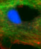

<!-- it seems like this page is automatically excluded from the side bar so yaml below is not necessary
---
nav_exclude: true
--- 
-->

# Summary
{: .no_toc }
[Button Link to webpage](http://example.com/){: .btn} <!--# .btn-blue-->
[Button Link to different section](#last-header){: .btn }

[normal link to different section](#last-header)

## Table of contents
{: .no_toc }

1. TOC
{:toc}

## Subheader
some random bla here

## and another header
* aaaa
* bbbb
* cccc

| Tables        | Images |
| ------------- | -------|
| [Guide Fluo](guides/GuideFluo.md)  | 
| [Guide Blobs](guides/GuideBlobs.md)  | 
| [Guide Mini](guides/GuideMini.md)  | 
| width="100" | 
| align="right" width="100" | 

## last header

* just
* some
* random
* text

