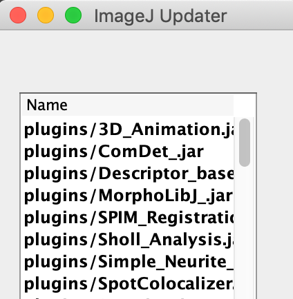
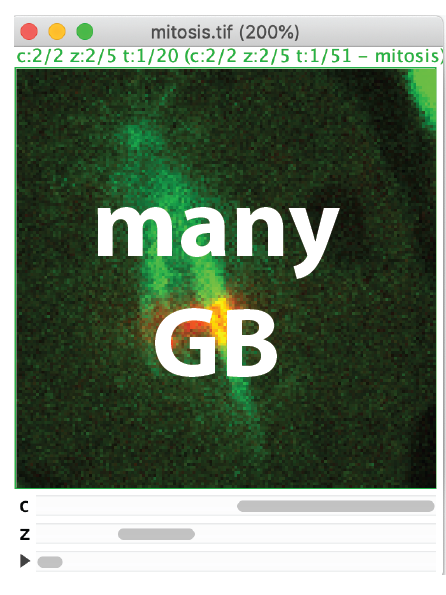
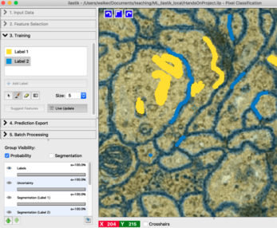
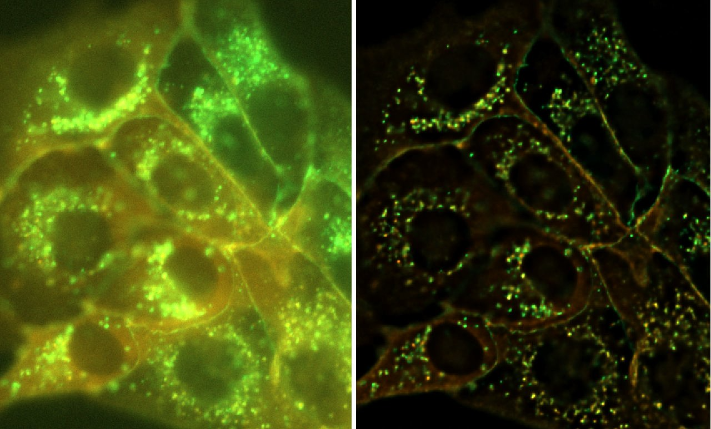

## About
{: .no_toc }

This page collects How-To guides for common image processing and analysis tasks.
It is written by the [Scientific Computing Facility](https://www.mpi-cbg.de/services-facilities/core-facilities/scientific-computing-facility/service-portfolio-overview/) at the MPI-CBG. If you have any questions or further ideas what guides to add just [contact us](mailto:ipf@mpi-cbg.de).

## Table of contents
{: .no_toc }

1. TOC
{:toc}

## Fiji
<table>
<tbody>
  <tr align="center" valign="top"> 
     <td> 	<!-- row 1, column 1 -->
	 <a href="guides/Fiji_KeepUpToDate">Keep Fiji Up-To-Date</a>    
	  
	</td>
    <td>  <!-- row 1, column 2 -->
	 <a href="guides/Fiji_OpenLargeData">Open Large Data</a>    
	  
	</td> 
    <td> <!-- row 1, column 3 -->
	<a href="guides/Template_Page">Template for new pages</a>    
	  
	</td> 

  </tr>
  <tr align="center" valign="top">
    <td> </td>
    <td></td>
    <td></td>
  </tr>
</tbody>
</table>

## Ilastik
<table>
<tbody>
  <tr align="center" valign="top"> 
     <td> 	<!-- row 1, column 1 -->
	 <a href="guides/Ilastik_PixelClassification">Pixel Classification (Image segmentation)</a>    
	  
	</td>
	<td></td>
	<td></td>

  </tr>
</tbody>
</table>

## Huygens 
<table>
<tbody>
  <tr align="center" valign="top"> 
     <td> 	<!-- row 1, column 1 -->
	 <a href="guides/Huygens_Deconvolution">Deconvolution with HuygensPro (Image restoration)</a>    
	  
	</td>
	<td></td>
	<td></td>

  </tr>
</tbody>
</table>

## Python 
<table>
<tbody>
  <tr align="center" valign="top"> 
     <td> 	<!-- row 1, column 1 -->
	 <a href="guides/Python_Conda_Environments">Image analysis with Python and Conda environments</a>    
	  
	</td>
	<td></td>
	<td></td>

  </tr>
</tbody>
</table>

## Imaris
... still coming ...

## Links and Resources
* [Our teaching material](https://git.mpi-cbg.de/scicomp/bioimage_team/coursematerialimageanalysis)
* [Wiki of our facility (account required)](https://wiki.mpi-cbg.de/scicomp/Main_Page)
	* Includes information on how to access licensed software like Huygens and Imaris.
* For more processing guides also check out the [core facilities at University of Zurich](https://zmb.dozuki.com/c/Image_Analysis#main) from where we got inspiration for this page.
